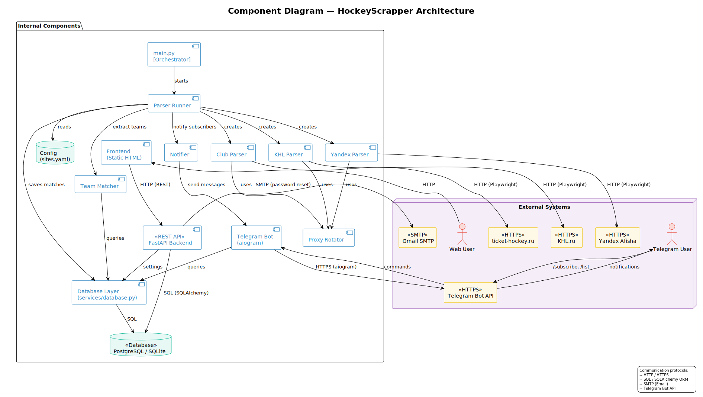

# HockeyScrapper 🏒

Track KHL hockey tickets. Scrapes ticket-hockey.ru, khl.ru, and Yandex Afisha for match tickets and sends Telegram notifications when tickets matching your subscriptions become available. Includes a web dashboard for managing subscriptions, profile, and account linking.

## Quick Links

- **Product access** — Run locally (see [Local Setup](#local-setup)) or deploy via [Render](render.yaml) / [Docker Compose](docker-compose.yml). No public deployment is currently active.
- **Hosted documentation** — [kamillayarullina.github.io/hockeyscrapper](https://kamillayarullina.github.io/hockeyscrapper/) — architecture, testing, ADRs, UATs, roadmap
- **Customer handover** — [docs/customer-handover.md](docs/customer-handover.md) — usage, deployment, troubleshooting, known limitations
- **Contributing** — [CONTRIBUTING.md](CONTRIBUTING.md) — how to contribute, workflow, review expectations
- **Agent guidance** — [AGENTS.md](AGENTS.md) — setup commands, safety cautions for coding agents

## Local Setup

```bash
git clone https://github.com/kamillayarullina/hockeyscrapper.git
cd hockeyscrapper
python -m venv .venv
source .venv/bin/activate    # Linux/macOS — Windows: .venv\Scripts\activate
pip install -r requirements.txt
playwright install chromium
cp .env.example .env          # edit .env with your BOT_TOKEN
```

Run everything (API + bot + parser):

```bash
python -m main --all
```

Open [http://localhost:8000](http://localhost:8000) in your browser. See [docs/development-process.md](docs/development-process.md) for component-specific flags and Docker deployment.

## Maintained Documentation

| Document | Audience |
|---|---|
| [Architecture](docs/architecture/README.md) | System design, ADRs, static/dynamic/deployment views |
| [Testing Strategy](docs/testing.md) | Test locations, coverage targets, QA gates |
| [Quality Requirements](docs/quality-requirements.md) | Measurable quality attributes (QR-01–QR-05) |
| [User Stories](docs/user-stories.md) | Requirements and story index |
| [User Acceptance Tests](docs/user-acceptance-tests.md) | UAT scenarios |
| [Definition of Done](docs/definition-of-done.md) | Completion standard |
| [Roadmap](docs/roadmap.md) | Upcoming sprints and milestones |

## Architecture Overview



The system follows a modular monolithic architecture: parsers, bot, backend, and frontend share a common database and service layer. See [architecture docs](docs/architecture/README.md) for the full static, dynamic, and deployment views.

## Stack

**Backend** — FastAPI, SQLAlchemy, JWT (python-jose)  
**Frontend** — HTML + CSS (vanilla)  
**Bot** — aiogram 3.x  
**Parsers** — Playwright, BeautifulSoup, aiohttp  
**Database** — SQLite (dev) / PostgreSQL (prod)  
**Hosting** — Render / Docker

## License

[MIT](LICENSE)
