# Week 2 Report: HockeyScrapper

**Team number:** 25

## 1. **Short description:** HockeyScrapper is a web platform that allows hockey fans to follow Kontinental Hockey League (KHL) teams and receive timely alerts about ticket sales.
Users can create an account, select their favourite teams and subscribe them. Once subscribed, the system automatically sends a notification as soon as ticket sales for a selected team's match begin. This ensures fans never miss the chance to buy tickets.

**Root LICENSE:** [`LICENSE`](../../LICENSE) — MIT

---

## 2. User Stories

[`reports/week2/user-stories.md`](user-stories.md)

---

## 3. Prototype and Interface Artifacts

**Interactive prototype (Figma):**
[HockeyScrapper Figma Prototype](https://www.figma.com/proto/QA9kxzUyxzBCnEycOYvinv/HockeyScrapper-Prototype?node-id=3-163&p=f&t=cW9lcLU0V8yCkDc5-1&scaling=scale-down&content-scaling=fixed&page-id=0%3A1&starting-point-node-id=3%3A163&show-proto-sidebar=1)

**Non-graphical interface (Telegram Bot):**
- Demonstration: [Telegram bot demo](https://drive.google.com/drive/folders/1KM8mjVmRVEtvAi60wAL4QUFikZs4Hz5z?usp=share_link)
- Documentation: [`docs/interface.md`](../../docs/interface.md)

---

## 4. MVP v0

- **Documentation:** [`reports/week2/mvp-v0-report.md`](mvp-v0-report.md)
- **Deployed MVP v0:** *(будет добавлено)*
- **Run instructions:** See [root README.md](../../README.md) for local setup.

---

## 5. PR/MR Workflow

- **PR template:** [`.github/pull_request_template.md`](../../.github/pull_request_template.md)
- **Reviewed PRs:**
  - [- **#7** — Fix broken links and Lychee config
- **#8** — Update README with project info
- **#9** — Add backend folder with auth and database
- **#11** — Update interface documentation (Telegram bot commands)
- **#12** — Update README structure
- **#13** — Full integration: API + Telegram bot + parsers connected
- **#14** — Update analysis report and parser fixes
- **#16** — Update LLM report and analysis
- **#17** — Merge main into feat-backend, fix DB and backend bugs
- **#18** — Update README with setup and usage instructions
- **#19** — Update README formatting and content
- **#21** — Backend fixes: CORS, JWT auth, DB schema improvements
- **#22** — Update README with local setup instructions
- **#23** — Merge feat-backend into main (API + frontend + bot)
- **#25** — Update customer meeting transcript
- **#26** — Add report links to README, update analysis]
- **Branch protection:** Protected default branch (main) — see screenshot below.

---

## 6-7. Lychee Link Checking

- **Configuration:** [`.lychee.toml`](../../.lychee.toml)
- **CI workflow:** [`.github/workflows/lychee.yml`](../../.github/workflows/lychee.yml)
- **Latest successful run:** [Actions tab](https://github.com/kamillayarullina/hockeyscrapper/actions/workflows/lychee.yml)

## Excluded Links Verification

| Link Pattern | Reason for Exclusion | Manual Check |
|:-------------|----------------------|:-------------:|
| `https://github.com/.*/issues/`, `https://github.com/.*/pull/` | Authentication required (403/429 for bots) | Yes |
| `https://www.figma.com/` | Interactive login required, bots blocked | Yes |
| `http://localhost`, `http://127.0.0.1` | Local dev only, not in CI/CD | Yes |
| `https://my-mvp-v0.example.com` | Documentation placeholder domain | N/A |
| `https://ticket-hockey.ru/.*` | Bot protection  | Yes |

---

## 8. Screenshots

### Protected default branch settings

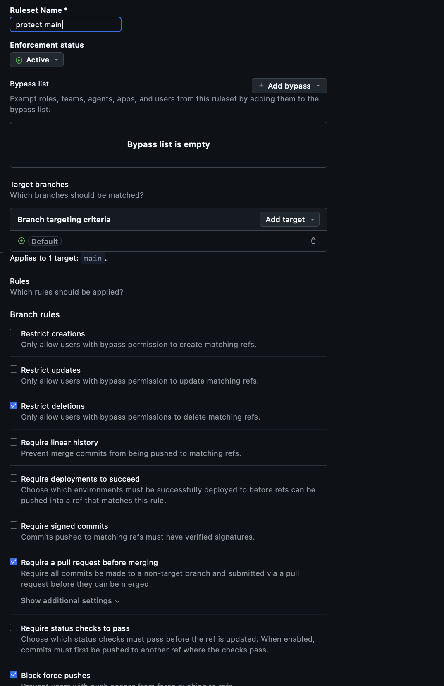

### Example reviewed PR/MR

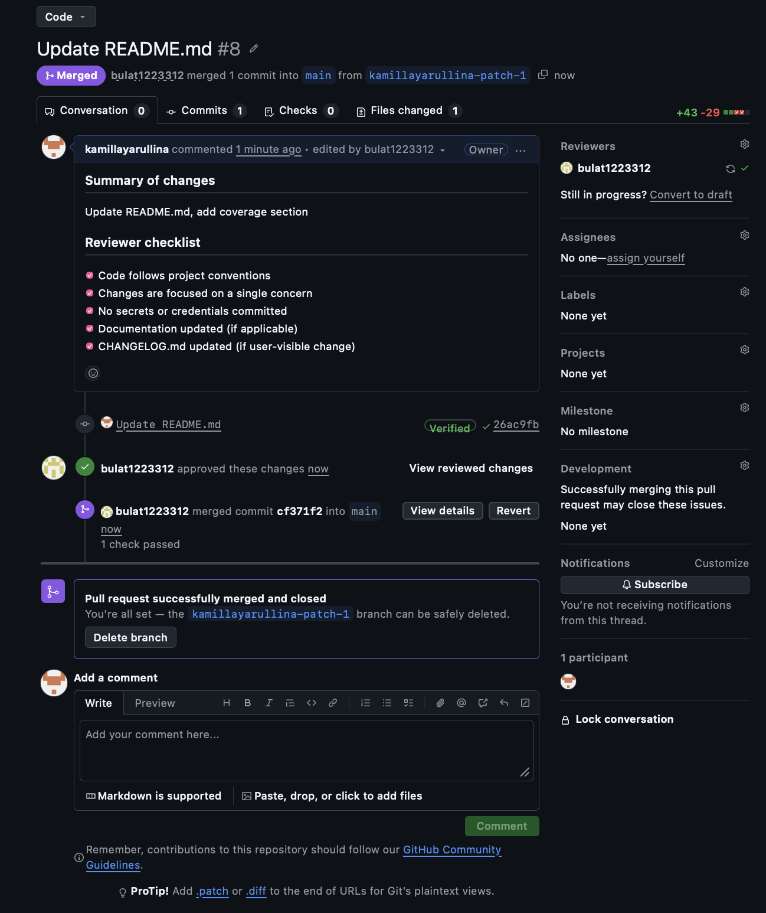
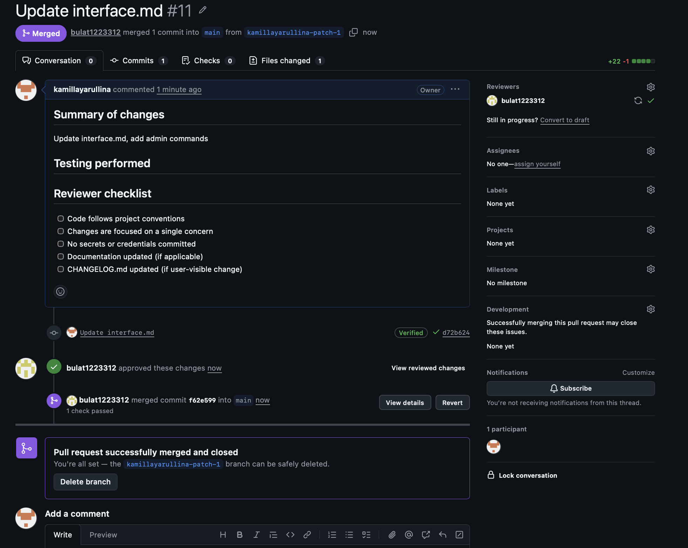

### Selected prototype and interface artifacts
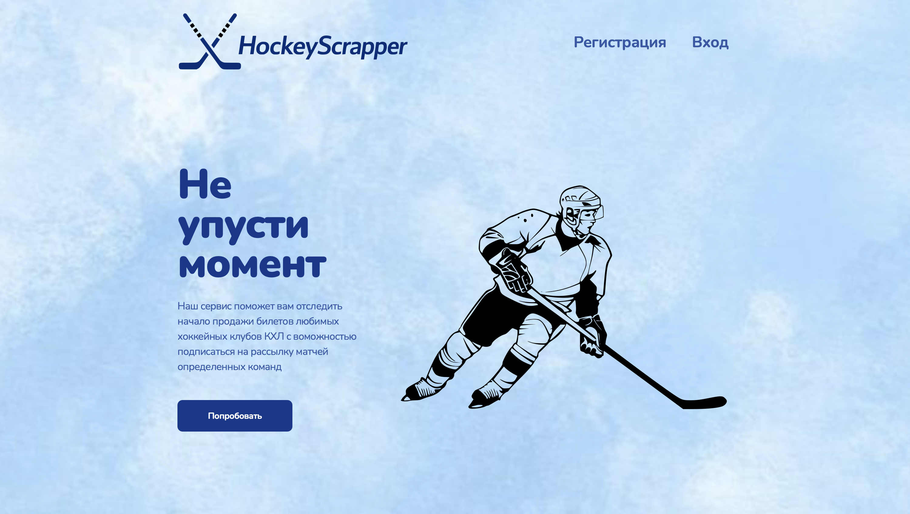
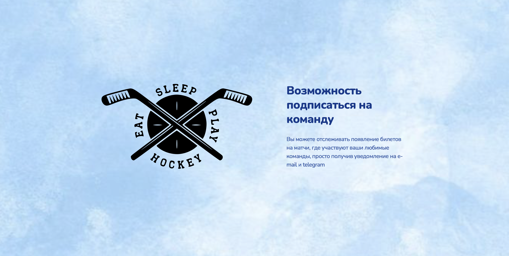
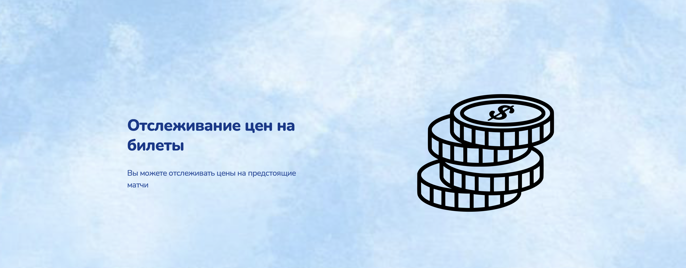
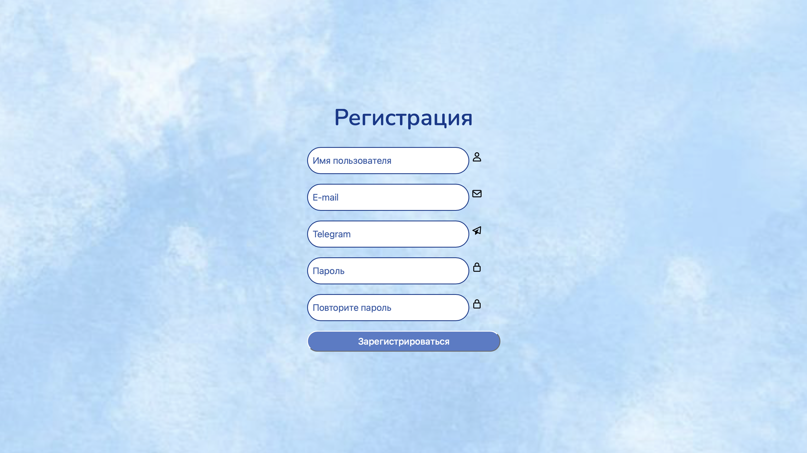
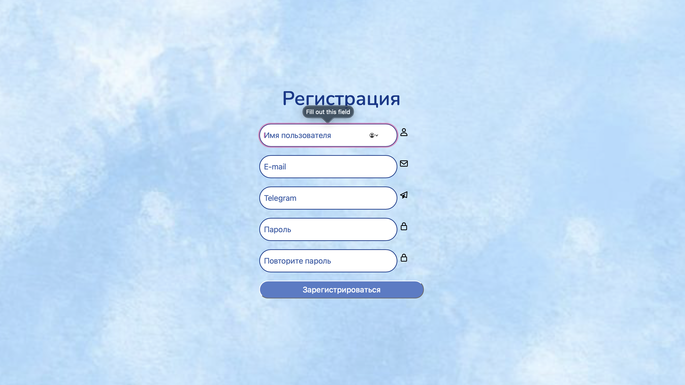
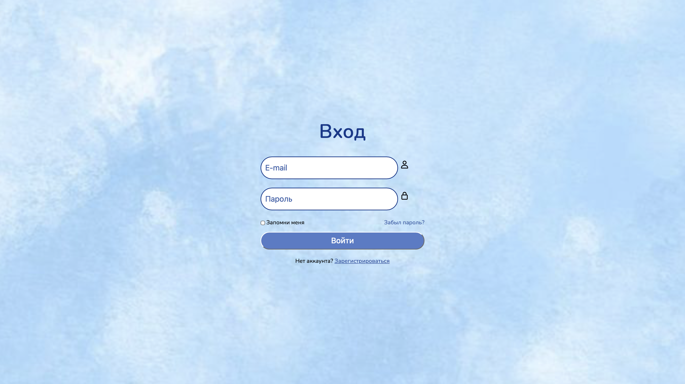
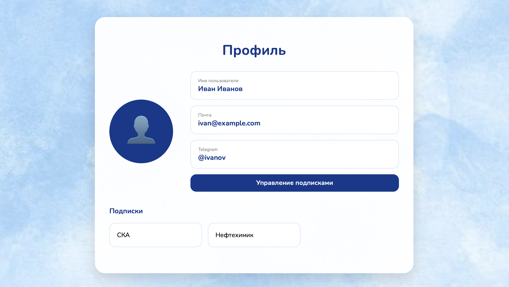
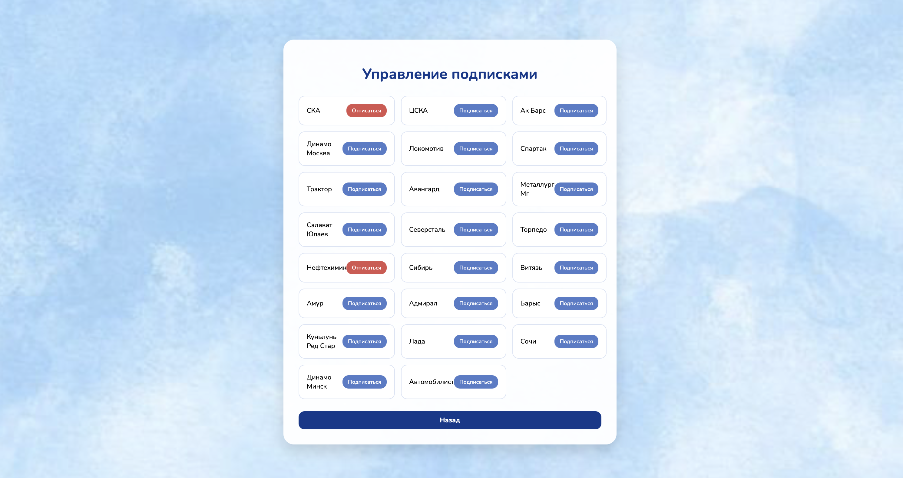

### Deployed MVP v0

---

## 9. Coverage

### Prototype coverage

The Figma prototype covers the following user stories:

| Screen/Flow | User Stories |
|-------------|-------------|
| Profile | US-07 |
| Team selection and subscription | US-01, US-04 |

### Interface artifacts coverage

The Telegram bot interface (documented in `docs/interface.md`) covers:

| Interface Element | User Stories |
|------------------|-------------|
| Subscribe command | US-01 |
| Teams command | US-04 |
| Match command | US-02, US-03 |
| Match notifications | US-05 |
| Admin commands | US-11 |

### Selected prototype and interface artifacts
We chose an **interactive Figma prototype** because it allows the customer to validate the user flow without backend implementation.  
The following artifacts are provided:

- **Figma prototype** – demonstrates US‑01, US‑04, US‑07 (team subscription, list of KHL teams, profile view with subscriptions).
- **Telegram bot** – demonstrates US‑01, US-02, US-03, US-04, US-05, US-11 (team subscription, date and time of the match, ticket price, list of KHL teams, notifications getting, websites parsing(only admin access)).

### MVP v0 coverage

See [`reports/week2/mvp-v0-report.md`](mvp-v0-report.md) for the MVP v0 foundation details and smoke-check scenario. MVP v0 supports the implementation of US-01(Subscription to team), US-02(Date and time of the match), US-03(Ticket price), US-04(List of KHL teams), US-05(Notifications only to telegram), US-07(Profile).

### User stories represented by MVP v0 (foundation only)
- **US‑01** – user can subscribe a team using telegram bot.
- **US‑02** – user can view date and time of the match using telegram bot.
- **US‑03** – user can view ticket price using telegram bot.
- **US‑04** – user can view list of KHL teams using telegram bot.
- **US‑05** – user can get notifications about match through telegram bot.
- **US‑11** – admin can edit parsing time through admin panel in telegram bot.

---

## 10-11. Customer Meeting

- **Transcript:** [`customer-meeting-transcript.md`](customer-meeting-transcript.md) (published with customer permission — see meeting summary)
- **Meeting summary:** [`customer-meeting-summary.md`](customer-meeting-summary.md)

---

## 12. Analysis

[`reports/week2/analysis.md`](analysis.md)

---

## 13. LLM Report

[`reports/week2/llm-report.md`](llm-report.md)
