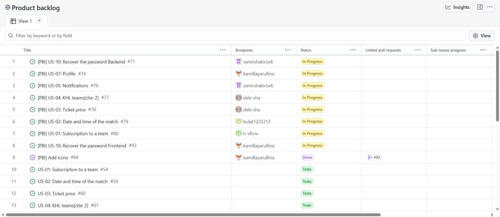
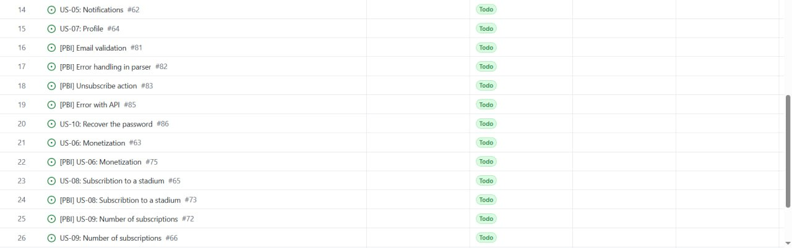
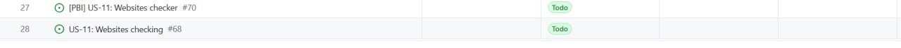
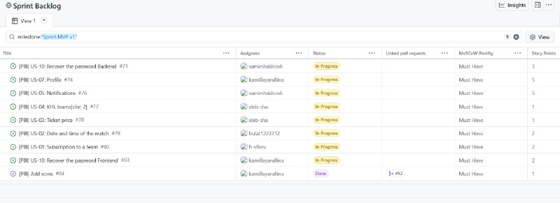
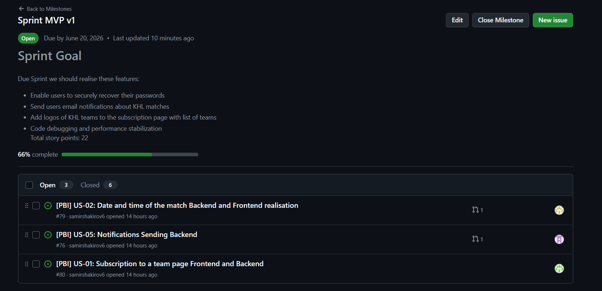
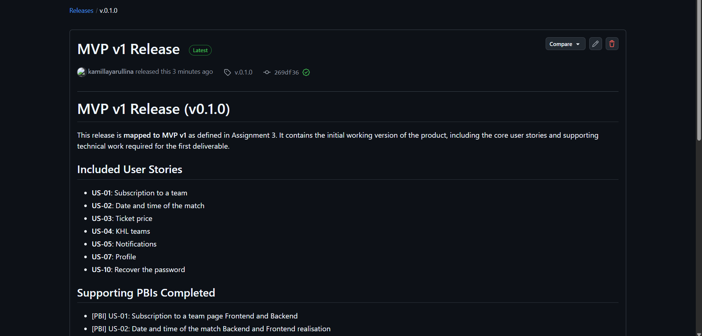
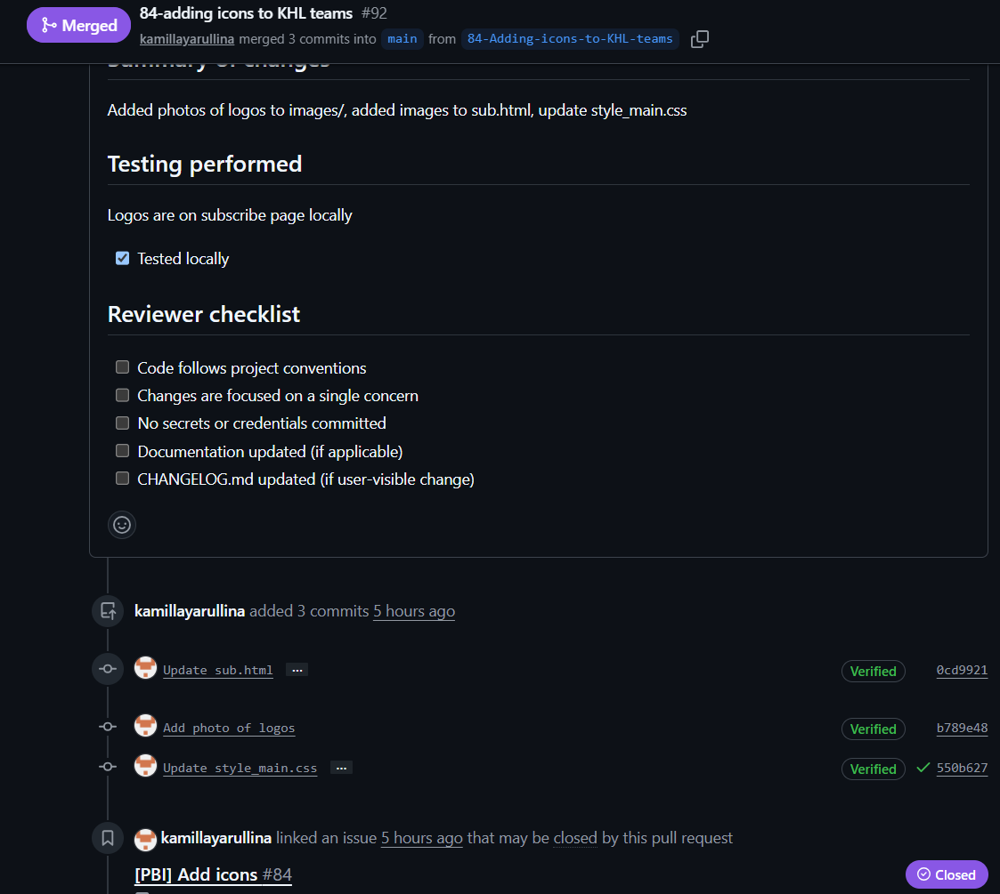

# Week 3 Report — MVP v1: HockeyScrapper

**Team number:** 25

**Project:** HockeyScrapper — a web platform that lets KHL fans follow teams, track ticket sales, and receive Telegram notifications.

**License:** [MIT](../../LICENSE)

---

## User Stories and PBI Scope (since Assignment 2)

Since Assignment 2 (Week 2), the initial user-story list was migrated into structured GitHub Issues with labels, story points, MVP version tags, and a Sprint milestone. The current scope is tracked in:

- [`docs/user-stories.md`](../../docs/user-stories.md) — authoritative table with issue links, work status, and Sprint assignment.
- GitHub Issues: [All open issues](https://github.com/kamillayarullina/hockeyscrapper/issues) (27 open) — PBIs are filed as `[PBI] US-*` user stories, `[PBI] *` technical PBIs, bug reports, and course tasks.
- History: [`reports/week2/user-stories.md`](../week2/user-stories.md) — original proposal with MoSCoW priorities.

### Customer Feedback from Assignment 2 — Addressed in MVP v1

| Feedback Point (Assignment 2) | Status in MVP v1 | Evidence |
|---|---|---|
| Add KHL team icons to the site | Addressed | [#84](https://github.com/kamillayarullina/hockeyscrapper/issues/84) (SP 1, merged PR [#92](https://github.com/kamillayarullina/hockeyscrapper/pull/92), screenshot below) |

---

## Backlog and Sprint

### Product Backlog

The Product Backlog contains all issues not yet assigned to a Sprint. Backlog is managed via GitHub Issues with the **Milestone** field left empty for uncommitted items.

- **Total Product Backlog size (Story Points):** 31 SP
- [**Board/view**](https://github.com/users/kamillayarullina/projects/3/views/1)

### Sprint 1

- **Sprint milestone:** [Sprint MVP v1](https://github.com/kamillayarullina/hockeyscrapper/milestone/1)
- **Sprint Goal:** Deliver complete user authentication, allow users to securely manage their profile, recover passwords, and receive notifications, and show price and date of a match.
- **Sprint dates:** June 14, 2026 — June 20, 2026
- **Total Sprint size:** 22 SP
- [**Sprint Backlog view**](https://github.com/users/kamillayarullina/projects/4)

### MVP v1 Scope

The MVP v1 scope is tracked via the **Sprint MVP v1 milestone** and the **MVP Version** field in each PBI (set to "MVP v1" in issue templates). The [milestone view](https://github.com/kamillayarullina/hockeyscrapper/milestone/1) serves as the authoritative grouped view.

**Selected MVP v1 scope:**

| PBI | Issue | SP | Status |
|---|---|---|---|
| US-01 Subscription to a team | [#80](https://github.com/kamillayarullina/hockeyscrapper/issues/80) | 2 | Done |
| US-02 Date and time of the match | [#79](https://github.com/kamillayarullina/hockeyscrapper/issues/79) | 2 | Done |
| US-03 Ticket price | [#78](https://github.com/kamillayarullina/hockeyscrapper/issues/78) | 1 | Done |
| US-04 KHL teams | [#77](https://github.com/kamillayarullina/hockeyscrapper/issues/77) | 1 | Done |
| US-05 Notifications | [#76](https://github.com/kamillayarullina/hockeyscrapper/issues/76) | 5 | In Progress |
| US-07 Profile | [#74](https://github.com/kamillayarullina/hockeyscrapper/issues/74) | 5 | Done |
| US-10 Recover password (backend) | [#71](https://github.com/kamillayarullina/hockeyscrapper/issues/71) | 3 | Done |
| US-10 Recover password (frontend) | [#93](https://github.com/kamillayarullina/hockeyscrapper/issues/93) | 2 | In Progress |
| Add team icons | [#84](https://github.com/kamillayarullina/hockeyscrapper/issues/84) | 1 | Done |

### PBI Management Approach

**PBI types** :
- **User Story** — end-user feature with acceptance criteria, MoSCoW priority, story points, MVP version, Sprint milestone.
- **Technical PBI** — infrastructure, database, API, frontend, testing, documentation, deployment tasks.
- **Bug Report** — defect with severity, reproduction steps, and MoSCoW priority.
- **Course Task** — assignment deliverable with deadline.

**Statuses:** To Do, In Progress, Done (tracked per-issue).

**Priorities:** MoSCoW (Must Have / Should Have / Could Have / Won't Have).

**Sprint milestone:** Each Sprint has a GitHub Milestone ([Sprint MVP v1](https://github.com/kamillayarullina/hockeyscrapper/milestone/1)) that defines the Sprint Goal, dates, and scope. PBIs are assigned to the milestone to indicate Sprint commitment.

**MVP Version tracking:** Each issue template includes an "MVP Version" field (v1 / v2 / v3). PBIs can be filtered by this label to show the MVP v1 scope.

**Task decomposition:** User stories are decomposed into frontend and backend PBIs where needed.

---

## Roadmap

The roadmap direction for Sprint 1 (current) and Sprint 2 (next):

- **Sprint 1 (MVP v1, June 14–20):** Core user authentication, team subscription management, match data, Telegram notifications, password recovery backend.
- **Sprint 2 (planned):** debugging server and addiing admin panel

Full roadmap: [`docs/roadmap.md`](../../docs/roadmap.md) (on branch `origin/samirshakirov6-patch-2`, PR [#101](https://github.com/kamillayarullina/hockeyscrapper/pull/101)).

---

## MVP v1 Verification Evidence

Completed MVP v1 PBIs verified via:
- **US-01 (#80):** Subscription flow works end-to-end (web + Telegram sync) — confirmed in [customer review transcript](customer-review-transcript.md).
- **US-07 (#74):** Profile page with subscription list live on deployed site.
- **US-10 (#71):** Password recovery backend endpoint functional.
- **#84:** Team icons visible on subscription page — see screenshot below.
- **#81:** Email validation enforced during registration.

---

## Product Status

MVP v1 is delivered and deployed at [link](http://139.100.225.113:8000/). Working: registration, login, subscription management (web + Telegram), KHL team listing, match data display, parser engine, Telegram bot, password recover.

---

## Next Steps

1.Admin panel

2.validation of telegram

3.validation of password

4.validation of email

---

## Contribution Traceability

| Team Member | GitHub | Issues Created | PRs/MRs Authored | PRs/MRs Reviewed |
|---|---|---|---|---|
| Kamilla Iarullina | [kamillayarullina](https://github.com/kamillayarullina) | [issues](https://github.com/kamillayarullina/hockeyscrapper/issues?q=is%3Aissue%20author%3Akamillayarullina) | [PRs](https://github.com/kamillayarullina/hockeyscrapper/issues?q=is%3Apr%20author%3Akamillayarullina) | [reviews](https://github.com/kamillayarullina/hockeyscrapper/issues?q=is%3Apr%20reviewed-by%3Akamillayarullina) |
| Gleb Shamiev | [xleb-sha](https://github.com/xleb-sha) | [issues](https://github.com/kamillayarullina/hockeyscrapper/issues?q=is%3Aissue%20author%3Axleb-sha) | [PRs](https://github.com/kamillayarullina/hockeyscrapper/issues?q=is%3Apr%20author%3Axleb-sha) | [reviews](https://github.com/kamillayarullina/hockeyscrapper/issues?q=is%3Apr%20reviewed-by%3Axleb-sha) |
| Samir Shakirov | [samirshakirov6](https://github.com/samirshakirov6) | [issues](https://github.com/kamillayarullina/hockeyscrapper/issues?q=is%3Aissue%20author%3Asamirshakirov6) | [PRs](https://github.com/kamillayarullina/hockeyscrapper/issues?q=is%3Apr%20author%3Asamirshakirov6) | [reviews](https://github.com/kamillayarullina/hockeyscrapper/issues?q=is%3Apr%20reviewed-by%3Asamirshakirov6) |
| Bulat Bulatov | [bulat1223312](https://github.com/bulat1223312) | [issues](https://github.com/kamillayarullina/hockeyscrapper/issues?q=is%3Aissue%20author%3Abulat1223312) | [PRs](https://github.com/kamillayarullina/hockeyscrapper/issues?q=is%3Apr%20author%3Abulat1223312) | [reviews](https://github.com/kamillayarullina/hockeyscrapper/issues?q=is%3Apr%20reviewed-by%3Abulat1223312) |
| Khamza Valikhanov | [h-vlhnv](https://github.com/h-vlhnv) | [issues](https://github.com/kamillayarullina/hockeyscrapper/issues?q=is%3Aissue%20author%3Ah-vlhnv) | [PRs](https://github.com/kamillayarullina/hockeyscrapper/issues?q=is%3Apr%20author%3Ah-vlhnv) | [reviews](https://github.com/kamillayarullina/hockeyscrapper/issues?q=is%3Apr%20reviewed-by%3Ah-vlhnv) |

---

## Quick Links

| Artifact | Link |
|---|---|
| Root CHANGELOG | [CHANGELOG.md](../../CHANGELOG.md) |
| Process & Requirements | [Process_Requirements.md](https://gitlab.pg.innopolis.university/swp_26/swp_26/-/blob/main/Process_Requirements.md) |
| Definition of Done | [docs/definition-of-done.md](../../docs/definition-of-done.md) |
| Roadmap | [`docs/roadmap.md`](../../docs/roadmap.md) (PR [#101](https://github.com/kamillayarullina/hockeyscrapper/pull/101)) |
| Issue templates | [`user-story.md`](../../.github/ISSUE_TEMPLATE/user-story.md), [`bug-report.md`](../../.github/ISSUE_TEMPLATE/bug-report.md), [`technical-pbi.md`](../../.github/ISSUE_TEMPLATE/technical-pbi.md), [`course-task.md`](../../.github/ISSUE_TEMPLATE/course-task.md) |
| PR/MR template | [`.github/pull_request_template.md`](../../.github/pull_request_template.md) |
| Historical report (Week 2) | [`reports/week2/README.md`](../week2/README.md) |
| Historical user stories | [`reports/week2/user-stories.md`](../week2/user-stories.md) |
| Current user stories | [`docs/user-stories.md`](../../docs/user-stories.md) |
| SemVer release | [Semver](https://github.com/kamillayarullina/hockeyscrapper/releases/tag/v.0.1.0) |
| Sprint milestone | [Sprint](https://github.com/kamillayarullina/hockeyscrapper/milestone/1) |
| Product Backlog | [Backlog](https://github.com/users/kamillayarullina/projects/3/views/1) |
| MVP v1 scope (milestone view) | [Sprint MVP v1 issues](https://github.com/kamillayarullina/hockeyscrapper/milestone/1) |
| Delivered MVP v1 deployment | [hockeyscrapper](http://139.100.225.113:8000/) |
| Run instructions | [Root README.md](../../README.md) |
| Video demonstration | [Google Drive video](https://drive.google.com/file/d/1DDY8UqRslHofFnP6QJy0ni2vLmquPmyX/view?usp=sharing) |

---

### Reviewed Issue-linked PRs/MRs (Week 3)

- [#80](https://github.com/kamillayarullina/hockeyscrapper/pull/120) — Add icons
- [#79](https://github.com/kamillayarullina/hockeyscrapper/pull/110) — send date and time of the match in the notification
- [#78](https://github.com/kamillayarullina/hockeyscrapper/pull/111) — send ticket price range in the notification
- [#77](https://github.com/kamillayarullina/hockeyscrapper/pull/113) — list of teams on the profile page
- [#76](https://github.com/kamillayarullina/hockeyscrapper/pull/114) — sending notifications about the start of the sales of the match
- [#74](https://github.com/kamillayarullina/hockeyscrapper/pull/109) — Update retrospective.md (merged, reviewed)
- [#71](https://github.com/kamillayarullina/hockeyscrapper/pull/108) — pssword recovery backend functionality
- [#93](https://github.com/kamillayarullina/hockeyscrapper/pull/117) — pssword recovery frontend functionality
- [#84](https://github.com/kamillayarullina/hockeyscrapper/pull/92) — add teams' icons

---

## Screenshots

### Product Backlog view (all open issues)

  
  

### Sprint Backlog view (milestone-filtered issues)

### Sprint milestone

### SemVer release

### Delivered MVP v1

### Example reviewed issue-linked PR/MR

---
| Name | Link |
|---|---|
Customer Review Transcript|[`customer-review-transcript.md`](customer-review-transcript.md).
Customer Review Summary|[`customer-review-summary.md`](customer-review-summary.md)
Week 3 Reflection|[`reflection.md`](reflection.md)
Retrospective|[`retrospective.md`](retrospective.md)
LLM Report|[`llm-report.md`](llm-report.md)
