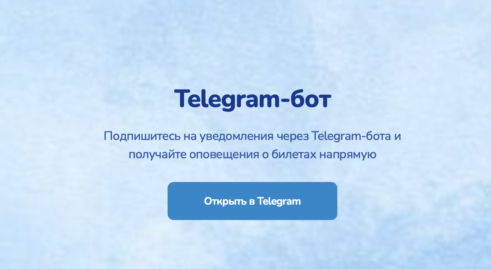
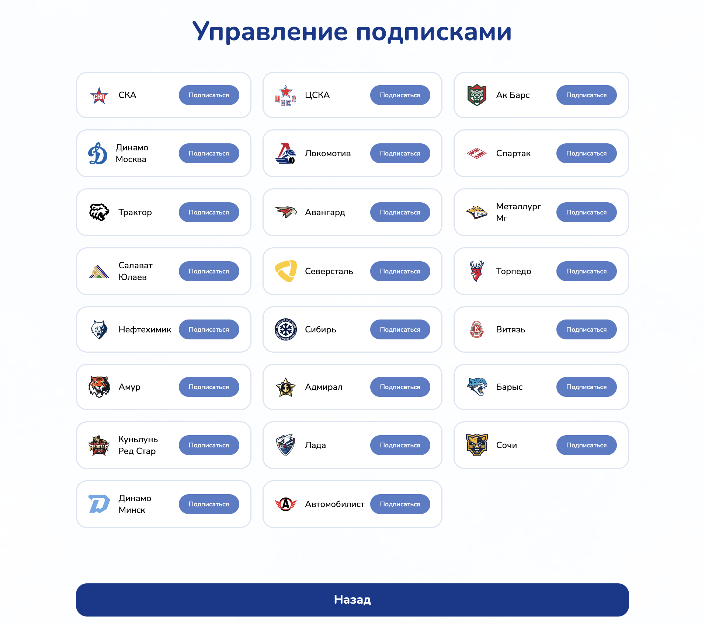
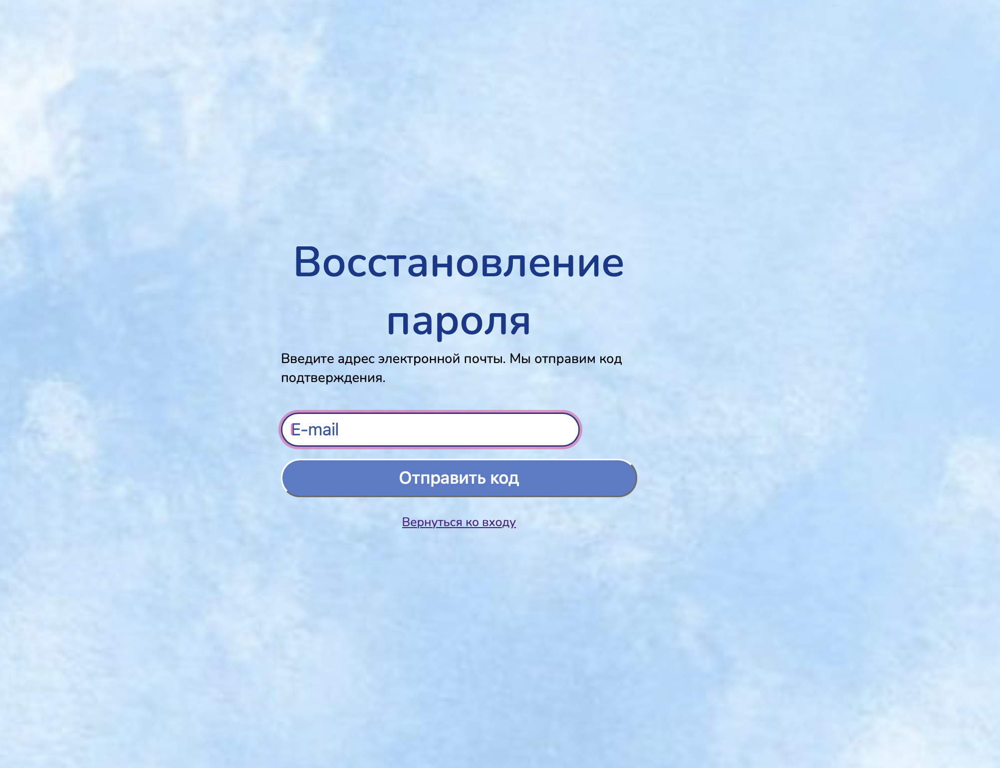
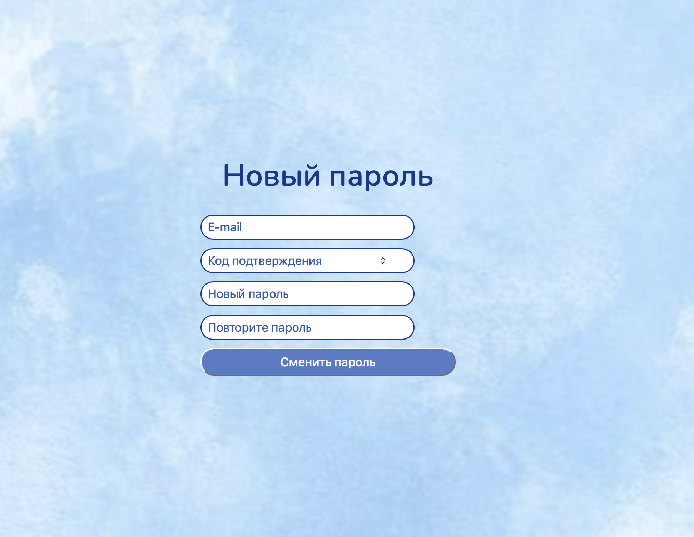

# Customer Meeting Summary

## Date and participants

20.06.2026
- Kamilla Iarullina
- Gleb Shamiev
- Samir Shakirov
- Bulat Bulatov

## Artifacts Demonstrated

## Scope reviewed
The team presented the current state of the product, covering:
- **Core Functionality:** Parser engine, user registration, and subscription system.
- **Cross-Platform Sync:** Subscriptions are synchronized between the website and Telegram bot.
- **Pending Features:** Password recovery (in progress while the meeting was) and email sending (not implemented yet).
- **Admin Capabilities:** Ability to change parsing times and manage proxies (via Telegram), but **database user management** (add/remove/change passwords) is absent.

## Implemented Increment Discussed
The main functional core is complete and deployable. The team has fixed critical registration bugs and demonstrated end-to-end subscription flow. The parser has been tested on the All-Star match ticket site and is scheduled for broader testing. The system architecture supports proxy configuration to handle anti-bot measures.

## Customer Feedback & Requested Changes

| # | Request / Feedback | Status / Team Response |
| :--- | :--- | :--- |
| 1 | **Add icons to the website.** | The team is already working on this, will be ready in MVP v1. |
| 2 | **Do not add icons to the Telegram bot.** | Accepted — customer explicitly declined this. |
| 3 | **Strengthen password validation** (minimum 8 characters, English alphabet only). | Accepted — the team agreed to implement standard validation. |
| 4 | **Keep the avatar feature** and allow users to upload a picture. | Accepted — the avatar icon will remain with upload capability. |
| 5 | **Implement a separate standalone admin panel** (website) instead of keeping it only in Telegram. | Approved — the customer suggested this if time permits, and the team agreed to build a separate site. |
| 6 | **Test parsing on ticket sales websites** (specifically FIFA World Cup tickets on Yandex.Afisha). | Planned — the team will test for captcha issues with increased frequency. |
| 7 | **Deploy to an internal/own server** rather than Render. | Planned — the team will migrate for better performance before sharing the final link. |

## Risks Identified

- Current deployment on a weak Render server causes extreme lag and slow performance. 
- The parser has not yet been tested against aggressive anti-bot measures (captcha) on major platforms like Yandex.Afisha. Potential failure of the core parsing feature under high-frequency scraping.
- Proxy functionality is implemented but not yet tested. If proxies fail, the system may get blocked during production use.
- Telegram handle registration fails if entered without the "@" symbol. Frustration for users; needs a robust input normalization fix.

  
## Action Points

1.  **Team:** Migrate the application from Render to an in-house/own server for better performance.
2.  **Team:** Test the parser on the FIFA World Cup ticket section (Yandex.Afisha) to evaluate captcha handling and parsing frequency limits.
3.  **Team:** Test the existing proxy integration thoroughly.
4.  **Team:** Implement password validation (minimum 8 characters, English letters only) during registration.
5.  **Team:** Add avatar upload functionality to the website.
7.  **Team:** Fix the Telegram handle input to accept usernames with or without the "@" symbol.
8.  **Customer:** Test the final deployed version once the link is sent and provide further detailed feedback.
9.  **Customer:** Draft and send specific requirements for the new standalone admin panel to the team.

## Resulting Product Backlog / Scope Changes

- **[New] Standalone Admin Panel Website:** Develop a separate web-based admin panel to manage users (add, delete, edit passwords) and database contents.
- **[New] Avatar Upload Feature:** Allow users to upload custom profile pictures.
- **[Modified] Password Policy:** Enforce a minimum of 8 characters using the English alphabet during registration.
- **[New] Input Normalization:** Automatically trim or append "@" to Telegram usernames during registration.
- **[Infrastructure] Server Migration:** Move hosting from Render to a dedicated/high-performance own server.
- **[Testing] Parsing & Proxies:** Formal test cycle for parsing high-traffic ticketing sites (World Cup) with proxy rotation and captcha handling.
