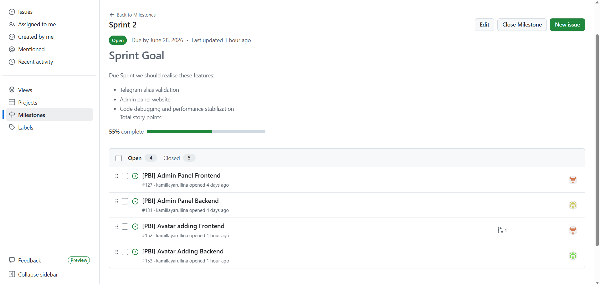
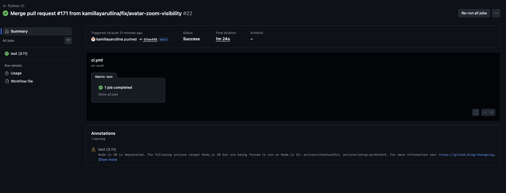
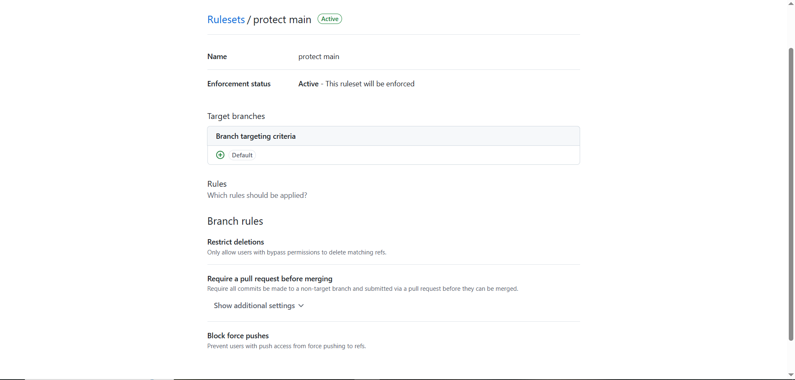
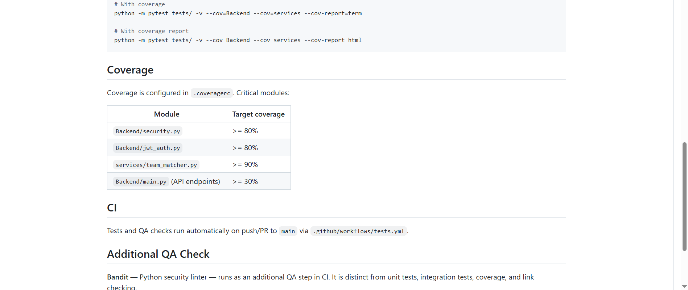
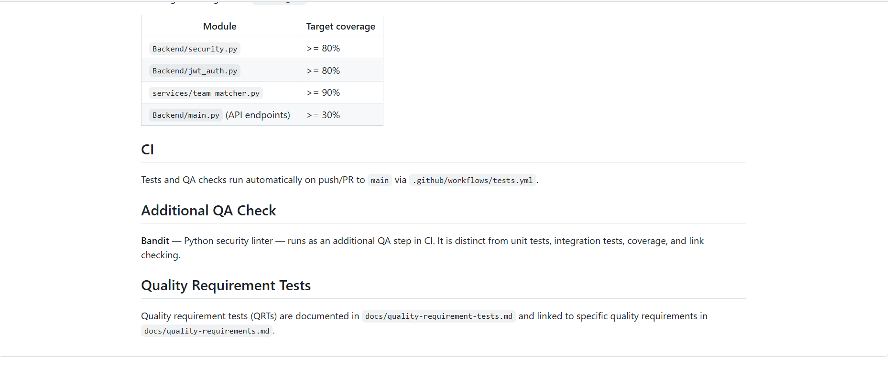
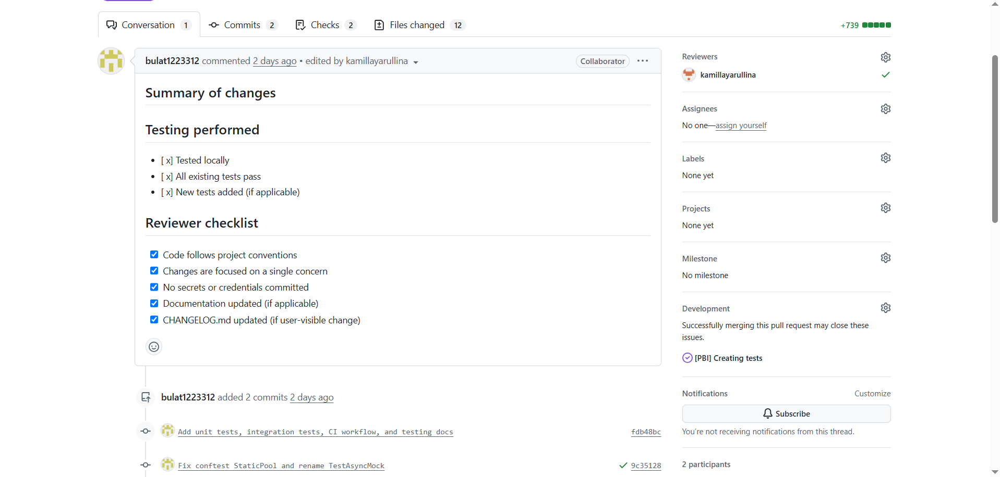

# Week 4 Report — MVP v2: HockeyScrapper

**Team number:** 25

**Project:** HockeyScrapper — a web platform that lets KHL fans follow teams, track ticket sales, and receive Telegram and email notifications.

**License:** [MIT](../../LICENSE)

---

## Backlog and Sprint

### Product Backlog

The Product Backlog contains all issues not yet assigned to a Sprint. Managed via GitHub Issues with the **Milestone** field left empty for uncommitted items.

- **Total Product Backlog size (Story Points):** 31 SP
- [**Product Backlog board**](https://github.com/users/kamillayarullina/projects/3/views/1)

### Sprint 2 — Assignment 4 Sprint

- **Sprint milestone:** [Assignment 4 Sprint — Milestone 2](https://github.com/kamillayarullina/hockeyscrapper/milestone/2)
- **Sprint Goal:** Validate password for stronger safety, and validate the input of Telegram alias.
- **Sprint dates:** June 22, 2026 — June 28, 2026
- **Total Sprint size:** 21 SP
- [**Sprint Backlog view**](https://github.com/users/kamillayarullina/projects/6)

### Sprint 2 Scope

| PBI | Issue | SP | Status |
|---|---|---|---|
| Telegram validation | [#126](https://github.com/kamillayarullina/hockeyscrapper/issues/126) | 1 | Done |
| Remove admin panel from Telegram bot | [#128](https://github.com/kamillayarullina/hockeyscrapper/issues/128) | 1 | Done |
| Password validation Frontend | [#129](https://github.com/kamillayarullina/hockeyscrapper/issues/129) | 1 | Done |
| Password validation Backend | [#130](https://github.com/kamillayarullina/hockeyscrapper/issues/130) | 2 | Done |
| Creating tests| [137](https://github.com/kamillayarullina/hockeyscrapper/issues/137) | 3 | Done |
| Avatar Adding Backend | [#131](https://github.com/kamillayarullina/hockeyscrapper/issues/153) | 2 | Done |
| Avatar Adding Frontend | [#127](https://github.com/kamillayarullina/hockeyscrapper/issues/127) | 1 | Done |
| Admin Panel Backend | [#131](https://github.com/kamillayarullina/hockeyscrapper/issues/131) | 5 | To Do |
| Admin Panel Frontend | [#127](https://github.com/kamillayarullina/hockeyscrapper/issues/127) | 5 | To Do |

We can not do admin panel as customer did not provide us the actions which admin panel should have

### Delivered Product Changes

| Change | Issue/PR | Summary |
|---|---|---|
| Telegram alias normalisation | [#126](https://github.com/kamillayarullina/hockeyscrapper/issues/126), PR [#139](https://github.com/kamillayarullina/hockeyscrapper/pull/139) | Registration now accepts Telegram handles with or without "@" prefix |
| Password validation | [#130](https://github.com/kamillayarullina/hockeyscrapper/issues/130), PR [#147](https://github.com/kamillayarullina/hockeyscrapper/pull/147) | Field validators enforce min length, digit, letter, and special-character rules |
| Password validation (frontend) | [#129](https://github.com/kamillayarullina/hockeyscrapper/issues/129) | Client-side password validation on registration and new-password forms |
| Admin panel frontend | [#127](https://github.com/kamillayarullina/hockeyscrapper/issues/127) | Standalone web admin panel UI |
| Admin panel backend | [#131](https://github.com/kamillayarullina/hockeyscrapper/issues/131) | Admin API endpoints for managing users, settings, and system config |
| Remove admin from Telegram bot | [#128](https://github.com/kamillayarullina/hockeyscrapper/issues/128), PR [#148](https://github.com/kamillayarullina/hockeyscrapper/pull/148) | Admin commands removed from Telegram bot — now admin panel is web-only |
| Quality requirements & QRTs | PR [#151](https://github.com/kamillayarullina/hockeyscrapper/pull/151) | Added `docs/quality-requirements.md`, `docs/quality-requirement-tests.md`, QRT test files |
| Unit & integration tests | PR [#138](https://github.com/kamillayarullina/hockeyscrapper/pull/138) | Added comprehensive test suite (60+ tests) with CI workflow |
| User acceptance tests | PR [#135](https://github.com/kamillayarullina/hockeyscrapper/pull/135) | UAT-001, UAT-002, UAT-003 documented |
| Definition of Done updates | PR [#148](https://github.com/kamillayarullina/hockeyscrapper/pull/148) | Updated DoD with mandatory gates and checklists |

### Deployment

- **Deployed product:** [http://89.125.169.128:8000/main.html](http://89.125.169.128:8000/main.html)

---

## Customer Feedback Response

| Feedback point | Resulting PBI or issue | Status | Response |
|---|---|---|---|
| Telegram handle registration fails if entered without "@" | [#126](https://github.com/kamillayarullina/hockeyscrapper/issues/126) | Done | System now normalises input — accepts with or without "@" |
| Customer requested standalone admin panel | [#131](https://github.com/kamillayarullina/hockeyscrapper/issues/131), [#127](https://github.com/kamillayarullina/hockeyscrapper/issues/127) | To Do | Carried forward to future sprint |
| Strengthen password validation | [#130](https://github.com/kamillayarullina/hockeyscrapper/issues/130), [#129](https://github.com/kamillayarullina/hockeyscrapper/issues/129) | Done | Min 8 chars, requires digit, letter, and special character |
| Keep avatar feature with upload capability |[#152](https://github.com/kamillayarullina/hockeyscrapper/issues/152),[153](https://github.com/kamillayarullina/hockeyscrapper/issues/153) | Done | Allow users to upload their pictures to the profile page |

### Feedback Not Addressed

- **Admin panel**: Identified as a desired feature but not rescheduled to futher sprints, due to the absence of customer response.

---

## Documentation

| Artifact | Link |
|---|---|
| Roadmap | [`docs/roadmap.md`](../../docs/roadmap.md) |
| Definition of Done | [`docs/definition-of-done.md`](../../docs/definition-of-done.md) |
| Quality Requirements | [`docs/quality-requirements.md`](../../docs/quality-requirements.md) |
| Quality Requirement Tests | [`docs/quality-requirement-tests.md`](../../docs/quality-requirement-tests.md) |
| Testing Strategy | [`docs/testing.md`](../../docs/testing.md) |
| User Acceptance Tests | [`docs/user-acceptance-tests.md`](../../docs/user-acceptance-tests.md) |

---

## Quality Model

The project uses the **ISO/IEC 25010** quality model. The following sub-characteristics are selected and addressed:

| Sub-characteristic | QR ID | How It Is Addressed |
|---|---|---|
| **Testability** | QR-001 | Critical modules (`Backend/security.py`, `Backend/jwt_auth.py`) have automated unit tests with coverage enforced via `fail_under >= 20` in `.coveragerc`. |
| **Analysability** | QR-002 | Bandit security linter runs as a CI gate, completing in under 30 seconds, providing fast feedback on security issues. |
| **Confidentiality** | QR-003 | Passwords stored only as bcrypt hashes (`$2b$` prefix, unique salt per hash), confirmed by automated tests. |

---

## Testing Status

### Test Suite Summary

| Test Type | File | Tests | Scope |
|---|---|---|---|
| Unit | `tests/test_team_matcher.py` | 23 | Team name extraction, normalisation, info lookup |
| Unit | `tests/test_security.py` | 9 | Password hashing and verification (bcrypt) |
| Unit | `tests/test_jwt_auth.py` | 12 | JWT token creation, verification, expiration |
| Integration | `tests/test_api_integration.py` | 16 | Register, login, forgot/new password, /me, /stats |
| QRT | `tests/test_qrt_coverage.py` | 3 | Validates `.coveragerc` config and threshold |
| QRT | `tests/test_qrt_bandit.py` | 3 | Validates bandit config and execution |
| **Total** | **6 files** | **66** | |

### Per-Module Line Coverage

| Module | Target | Status |
|---|---|---|
| `Backend/security.py` | >= 80% | ✅ |
| `Backend/jwt_auth.py` | >= 80% | ✅ |
| `services/team_matcher.py` | >= 90% | ✅ |
| `Backend/main.py` (API) | >= 30% | ✅ |

### Test Links

- **Unit tests:** [`tests/test_team_matcher.py`](../../tests/test_team_matcher.py), [`tests/test_security.py`](../../tests/test_security.py), [`tests/test_jwt_auth.py`](../../tests/test_jwt_auth.py)
- **Integration tests:** [`tests/test_api_integration.py`](../../tests/test_api_integration.py)
- **Quality requirement tests:** [`tests/test_qrt_coverage.py`](../../tests/test_qrt_coverage.py), [`tests/test_qrt_bandit.py`](../../tests/test_qrt_bandit.py)

---

## CI/CD

| Artifact | Link |
|---|---|
| CI pipeline | [`.github/workflows/tests.yml`](../../.github/workflows/tests.yml) |
| Latest protected-default-branch CI run | [Actions: Tests & QA](https://github.com/kamillayarullina/hockeyscrapper/actions/workflows/tests.yml) |
| Link check CI | [`.github/workflows/lychee.yml`](../../.github/workflows/lychee.yml) |  

### CI Checks

The CI pipeline (`Tests & QA`) runs on every push/PR to `main`:

1. **Bandit security lint** — additional QA check distinct from unit/integration tests
2. **pytest with coverage** — runs all unit + integration + QRT tests with coverage reporting
3. **Coverage artifact upload** — XML report available for download

### Branch Protection

The `main` branch is protected with:

- Require pull request reviews before merging
- Require status checks to pass (Tests & QA, Lychee)
- Require branches to be up-to-date

### How A4 Tests, CI, QR, and DoD Govern Later Work

The Assignment 4 infrastructure establishes a permanent quality gate for all future development:

1. **Definition of Done** — every PBI (user story, technical PBI, or bug report) must pass the applicable DoD checklist before it can be merged. This covers acceptance criteria, peer review, test coverage, and changelog updates.

2. **CI pipeline** — automatically runs on every push/PR to `main`, enforcing Bandit security lint, pytest coverage thresholds, and link validation via Lychee. A PR cannot merge if any check fails.

3. **Quality Requirement Tests (QRTs)** — `test_qrt_coverage.py` and `test_qrt_bandit.py` validate that the coverage gate and security-lint configuration remain intact after any change to `.coveragerc` or `pyproject.toml`. Any PR that weakens these controls is automatically rejected.

4. **Coverage `fail_under = 20`** — a hard floor that prevents overall line coverage from dropping below 20%. As the codebase grows, this threshold will be raised to maintain discipline.

Together these mechanisms ensure that Sprint 3+ work cannot bypass the quality practices established in Assignment 4.

---

## Release

| Artifact | Link |
|---|---|
| SemVer release | [v.0.1.0](https://github.com/kamillayarullina/hockeyscrapper/releases/tag/v.0.1.0) |
| CHANGELOG | [`CHANGELOG.md`](../../CHANGELOG.md) |

---

## Demo Video

Public sanitized demo video  
[https://drive.google.com/file/d/1DDY8UqRslHofFnP6QJy0ni2vLmquPmyX/view?usp=sharing](https://drive.google.com/file/d/1DDY8UqRslHofFnP6QJy0ni2vLmquPmyX/view?usp=sharing) — demonstration of key MVP v2 features.

---

## Presentation Slides

- [`reports/week4/presentation.pdf`](presentation.pdf) — sanitized public copy of the presentation slides.

---

## User Acceptance Testing

- **UAT results summary:** [`docs/user-acceptance-tests.md`](../../docs/user-acceptance-tests.md)
  - UAT-001 (Subscribe to a team) — Active
  - UAT-002 (Unsubscribe team) — Active
  - UAT-003 (Password Recovery) — Active

---

## Customer Review

review could not be conducted this week

## Week 4 Reports

| Report | Link |
|---|---|
| Reflection | [`reports/week4/reflection.md`](reflection.md) |
| Retrospective | [`reports/week4/retrospective.md`](retrospective.md) |
| LLM Report | [`reports/week4/llm-report.md`](llm-report.md) |

---

## Product Status

**Current state:** current product is delivered and deployed at [http://139.100.225.113:8000/](http://139.100.225.113:8000/).

**Working features:** Registration with field validation, login with JWT auth, subscription management (web + Telegram sync), KHL team listing with icons, match data display, parser engine (khl.ru, ticket-hockey.ru, Yandex.Afisha), Telegram bot with commands, password recovery via email code, Telegram account linking, password/email/username field validators, Telegram alias normalisation, team icons in subscription UI.

---

## Next Steps

1. **Parser testing on Yandex.Afisha** — test captcha handling and rate limits for World Cup tickets
2. **Monetisation (US-06)** — begin planning subscription tiers or payment integration

---

## Contribution Traceability

| Team Member | GitHub | Issues Created | PRs/MRs Authored | PRs/MRs Reviewed |
|---|---|---|---|---|
| Kamilla Iarullina | [kamillayarullina](https://github.com/kamillayarullina) | [issues](https://github.com/kamillayarullina/hockeyscrapper/issues?q=is%3Aissue+author%3Akamillayarullina) | [PRs](https://github.com/kamillayarullina/hockeyscrapper/issues?q=is%3Apr+author%3Akamillayarullina) | [reviews](https://github.com/kamillayarullina/hockeyscrapper/issues?q=is%3Apr+reviewed-by%3Akamillayarullina) |
| Gleb Shamiev | [xleb-sha](https://github.com/xleb-sha) | [issues](https://github.com/kamillayarullina/hockeyscrapper/issues?q=is%3Aissue+author%3Axleb-sha) | [PRs](https://github.com/kamillayarullina/hockeyscrapper/issues?q=is%3Apr+author%3Axleb-sha) | [reviews](https://github.com/kamillayarullina/hockeyscrapper/issues?q=is%3Apr+reviewed-by%3Axleb-sha) |
| Samir Shakirov | [samirshakirov6](https://github.com/samirshakirov6) | [issues](https://github.com/kamillayarullina/hockeyscrapper/issues?q=is%3Aissue+author%3Asamirshakirov6) | [PRs](https://github.com/kamillayarullina/hockeyscrapper/issues?q=is%3Apr+author%3Asamirshakirov6) | [reviews](https://github.com/kamillayarullina/hockeyscrapper/issues?q=is%3Apr+reviewed-by%3Asamirshakirov6) |
| Bulat Bulatov | [bulat1223312](https://github.com/bulat1223312) | [issues](https://github.com/kamillayarullina/hockeyscrapper/issues?q=is%3Aissue+author%3Abulat1223312) | [PRs](https://github.com/kamillayarullina/hockeyscrapper/issues?q=is%3Apr+author%3Abulat1223312) | [reviews](https://github.com/kamillayarullina/hockeyscrapper/issues?q=is%3Apr+reviewed-by%3Abulat1223312) |
| Khamza Valikhanov | [h-vlhnv](https://github.com/h-vlhnv) | [issues](https://github.com/kamillayarullina/hockeyscrapper/issues?q=is%3Aissue+author%3Ah-vlhnv) | [PRs](https://github.com/kamillayarullina/hockeyscrapper/issues?q=is%3Apr+author%3Ah-vlhnv) | [reviews](https://github.com/kamillayarullina/hockeyscrapper/issues?q=is%3Apr+reviewed-by%3Ah-vlhnv) |

---

## Screenshots

### Sprint Milestone

### Latest Protected-Default-Branch CI Run

### Branch Protection / Rules Evidence

### Coverage / Test Report

### Additional QA Check Result (Bandit)

### SemVer Release

### Example Reviewed Issue-Linked PR/MR

---

## Quick Links Summary

| Artifact | Link |
|---|---|
| Product Backlog | [Board](https://github.com/users/kamillayarullina/projects/3/views/1) |
| Sprint Backlog | [Board](https://github.com/users/kamillayarullina/projects/6) |
| Sprint 2 Milestone | [Milestone 2](https://github.com/kamillayarullina/hockeyscrapper/milestone/2) |
| Deployed product | [http://139.100.225.113:8000/](http://139.100.225.113:8000/) |
| CHANGELOG | [`CHANGELOG.md`](../../CHANGELOG.md) |
| SemVer release | [v.0.1.0](https://github.com/kamillayarullina/hockeyscrapper/releases/tag/v.0.1.0) |
| CI pipeline | [Tests & QA](https://github.com/kamillayarullina/hockeyscrapper/actions/workflows/tests.yml) |
| Demo video | `https://drive.google.com/file/d/1DDY8UqRslHofFnP6QJy0ni2vLmquPmyX/view?usp=sharing` |
| Presentation | [`reports/week4/presentation.pdf`](presentation.pdf) |
