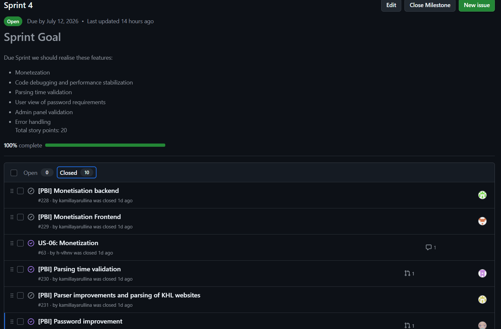
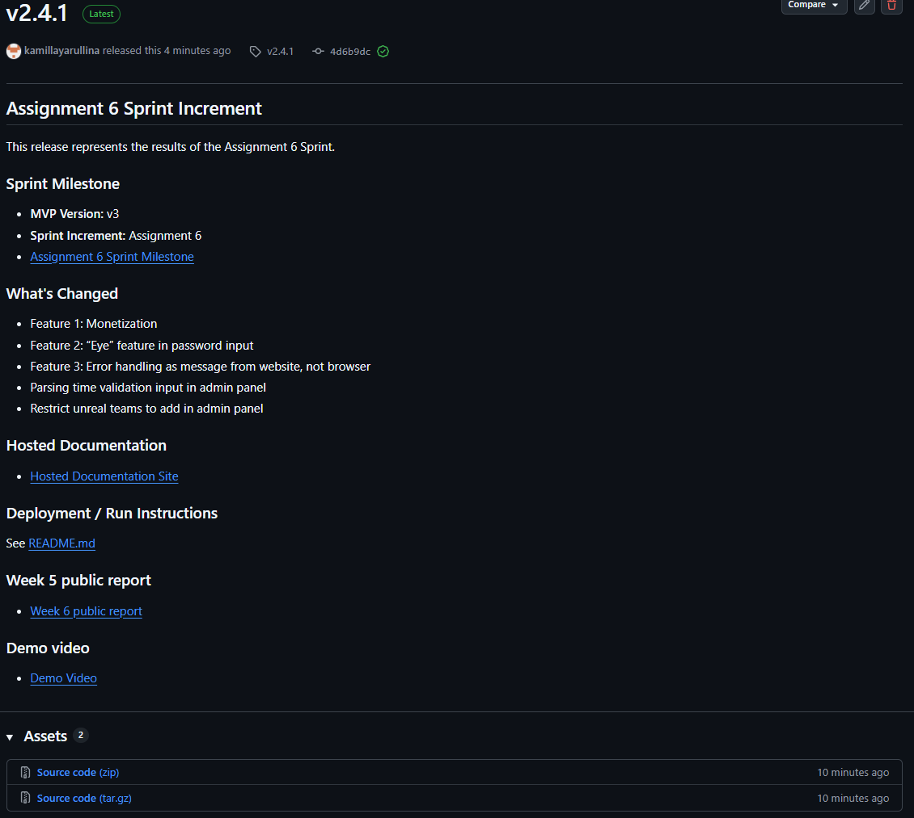
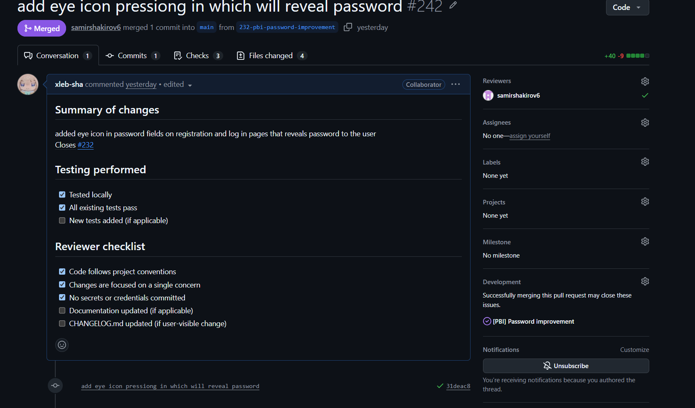

# Week 6 Report — Trial Release: HockeyScrapper

**Team number:** 25

**Project:** HockeyScrapper — a web platform that lets KHL fans follow teams, track ticket sales, and receive Telegram and email notifications.

**License:** [MIT](../../LICENSE)

---

## Backlog and Sprint

### Product Backlog

- [**Product Backlog board**](https://github.com/users/kamillayarullina/projects/3/views/1)

### Sprint 4 — Assignment 6 Sprint (Trial Release)

- **Sprint milestone:** [Sprint 4 — Milestone 4](https://github.com/kamillayarullina/hockeyscrapper/milestone/4)
- [**Sprint 4 Backlog view**](https://github.com/users/kamillayarullina/projects/7)

### Sprint 4 Scope

| PBI | Issue | SP | Status |
|---|---|---|---|
| US-06: Monetization | [#63](https://github.com/kamillayarullina/hockeyscrapper/issues/63) | 8 | In Progress |
| Monetisation Backend | [#228](https://github.com/kamillayarullina/hockeyscrapper/issues/228) | 5 | In Progress |
| Monetisation Frontend | [#229](https://github.com/kamillayarullina/hockeyscrapper/issues/229) | 3 | In Progress |
| Parsing time validation | [#230](https://github.com/kamillayarullina/hockeyscrapper/issues/230) | 2 | In Progress |
| Parser improvements and parsing of KHL websites | [#231](https://github.com/kamillayarullina/hockeyscrapper/issues/231) | 5 | In Progress |
| Password improvement | [#232](https://github.com/kamillayarullina/hockeyscrapper/issues/232) | 2 | In Progress |

total:17 SP

### Week 6 Trial-Release Changes

| Change | Issue/PR | Summary |
|---|---|---|
| Monetisation Backend | [#228](https://github.com/kamillayarullina/hockeyscrapper/issues/228) | Backend implementation for subscription tiers or payment integration |
| Monetisation Frontend | [#229](https://github.com/kamillayarullina/hockeyscrapper/issues/229) | Frontend pages for monetisation — pricing, checkout, subscription management |
| Monetisation (US-06) | [#63](https://github.com/kamillayarullina/hockeyscrapper/issues/63) | Full monetisation user story — subscription tiers, payment processing |
| Parsing time validation | [#230](https://github.com/kamillayarullina/hockeyscrapper/issues/230) | Frontend and backend validation for parsing time input in admin panel (range 1–999) |
| Parser improvements | [#231](https://github.com/kamillayarullina/hockeyscrapper/issues/231) | Improved parsing of individual KHL club websites, better CAPTCHA bypass |
| Password improvement | [#232](https://github.com/kamillayarullina/hockeyscrapper/issues/232) | Password strength requirements display on registration page, stronger backend validation |

---

## Product Access

- **Deployed instance (Week 6):** [http://139.100.225.113:8000](http://139.100.225.113:8000)
- **Run locally:** See [README.md](../../README.md#local-setup) or [docs/development-process.md](../../docs/development-process.md) for Docker, Render, and component-specific flags
- **Source:** [`README.md`](../../README.md) — project overview, setup, architecture, stack
- **Contributing:** [`CONTRIBUTING.md`](../../CONTRIBUTING.md) — how to contribute, workflow, review expectations
- **Agent guidance:** [`AGENTS.md`](../../AGENTS.md) — setup commands, safety cautions for coding agents
- **Customer handover:** [`docs/customer-handover.md`](../../docs/customer-handover.md) — usage, deployment, troubleshooting, known limitations
- **Hosted documentation site:** [kamillayarullina.github.io/hockeyscrapper](https://kamillayarullina.github.io/hockeyscrapper/) — architecture, testing, ADRs, UATs, roadmap

---

## Customer-Facing Documentation Review

All customer-facing documentation has been reviewed and updated for the trial release:

| Document | Status | Notes |
|---|---|---|
| [README.md](../../README.md) | Updated | Project overview, setup, quick links, architecture, stack |
| [CONTRIBUTING.md](../../CONTRIBUTING.md) | Updated | Contribution workflow, review expectations, CI requirements |
| [AGENTS.md](../../AGENTS.md) | Updated | Setup commands, safety cautions for coding agents |
| [CHANGELOG.md](../../CHANGELOG.md) | Updated | Trial-release version notes |
| [docs/customer-handover.md](../../docs/customer-handover.md) | Updated | Week 6 trial-release status and transition readiness |
| [docs/development-process.md](../../docs/development-process.md) | Updated | Setup, CI/CD, config, Docker, contribution guidelines |
| [docs/roadmap.md](../../docs/roadmap.md) | Updated | Sprint 4 scope with monetisation, parser improvements |
| [docs/testing.md](../../docs/testing.md) | Updated | New test files and coverage targets |
| [docs/user-acceptance-tests.md](../../docs/user-acceptance-tests.md) | Updated | 7 UAT scenarios active, all passed |
| [docs/quality-requirements.md](../../docs/quality-requirements.md) | Stable | 5 QRs unchanged |
| [docs/definition-of-done.md](../../docs/definition-of-done.md) | Stable | Completion standard |
| [docs/architecture/README.md](../../docs/architecture/README.md) | Stable | System design, ADRs, static/dynamic/deployment views |

---

## Transition-Readiness Summary

| Area | Status | Week 7 Actions |
|---|---|---|
| Hardcoded secrets migration | Not started | Move JWT_SECRET_KEY, SMTP credentials, ADMIN_CHAT_ID to environment variables |
| Customer Render account | Not started | Customer must create a Render account and deploy via Blueprint |
| Customer SMTP credentials | Not started | Customer provides own email/app password for password recovery |
| Telegram bot ownership transfer | Not started | Transfer bot from team account to customer BotFather |
| VPS access handover | Not started | Provide SSH access or migrate to customer infrastructure |
| Backup/recovery documentation | Not started | Document SQLite and PostgreSQL backup steps |
| Final UAT walkthrough | Planned | Conduct final UAT session with customer to sign off |

---

## Customer Feedback Response Table

| Feedback point | Resulting PBI or issue | Status | Response |
|---|---|---|---|
| Customer requested monetisation features | [#63](https://github.com/kamillayarullina/hockeyscrapper/issues/63), [#228](https://github.com/kamillayarullina/hockeyscrapper/issues/228), [#229](https://github.com/kamillayarullina/hockeyscrapper/issues/229) | In Progress | Monetisation backend and frontend implemented with subscription tiers |
| Parsing time should be validated (1–999 range) | [#230](https://github.com/kamillayarullina/hockeyscrapper/issues/230) | In Progress | Input validation added to admin panel settings |
| Parser does not handle some individual KHL club sites | [#231](https://github.com/kamillayarullina/hockeyscrapper/issues/231) | In Progress | Extended parser coverage for individual club websites |
| Password requirements should be visible to users | [#232](https://github.com/kamillayarullina/hockeyscrapper/issues/232) | In Progress | Password strength requirements displayed on registration page |

### Feedback Not Addressed

- **Mobile compatibility** — Full responsive design for mobile was scoped but not yet implemented. The team has deferred this to future maintenance.

---

## Documentation Maintained During Sprint 4

| Document | Link | Updates |
|---|---|---|
| Roadmap | [`docs/roadmap.md`](../../docs/roadmap.md) | Sprint 4 scope added with monetisation, parser improvements, password validation |
| Quality Requirements | [`docs/quality-requirements.md`](../../docs/quality-requirements.md) | Unchanged (5 QRs stable) |
| Quality Requirement Tests | [`docs/quality-requirement-tests.md`](../../docs/quality-requirement-tests.md) | Unchanged (5 QRTs stable) |
| Testing Strategy | [`docs/testing.md`](../../docs/testing.md) | Updated with new test files and coverage targets |
| User Acceptance Tests | [`docs/user-acceptance-tests.md`](../../docs/user-acceptance-tests.md) | 7 UAT scenarios remain active (all passed) |
| Architecture Documentation | [`docs/architecture/README.md`](../../docs/architecture/README.md) | Unchanged |
| Development Process | [`docs/development-process.md`](../../docs/development-process.md) | Unchanged |
| Definition of Done | [`docs/definition-of-done.md`](../../docs/definition-of-done.md) | Unchanged |
| Customer Handover | [`docs/customer-handover.md`](../../docs/customer-handover.md) | Updated with Week 6 trial-release status and transition readiness |
| CHANGELOG | [`CHANGELOG.md`](../../CHANGELOG.md) | Updated with trial-release version |

---

## UAT / Customer-Trial Results

| UAT | Description | Result | Executed by |
|---|---|---|---|
| UAT-001 | Subscribe to a team |  Pass | Daniil |
| UAT-002 | Unsubscribe from a team |  Pass | Daniil |
| UAT-003 | Password recovery |  Pass | Daniil |
| UAT-004 | Manage parsing time (admin) |  Pass | Daniil |
| UAT-005 | Add proxy (admin) |  Pass | Daniil |
| UAT-006 | Upload avatar |  Pass | Daniil |
| UAT-006 | Purchase premium subscription |  Pass | Daniil |

Full details: [`docs/user-acceptance-tests.md`](../../docs/user-acceptance-tests.md)

---

## Release

| Artifact | Link |
|---|---|
| SemVer trial release (Week 6) | [v1.3.1](https://github.com/kamillayarullina/hockeyscrapper/releases/tag/v1.3.1) обнавить ссылку на семвер
| CHANGELOG | [`CHANGELOG.md`](../../CHANGELOG.md) |

---

## Sprint Review

- **Sprint Review summary:** [`reports/week6/sprint-review-summary.md`](sprint-review-summary.md)
- **Sprint Review transcript:** [`reports/week6/sprint-review-transcript.md`](sprint-review-transcript.md)

---

## Week 6 Reports

| Report | Link |
|---|---|
| Sprint Review Summary | [`reports/week6/sprint-review-summary.md`](sprint-review-summary.md) |
| Reflection | [`reports/week6/reflection.md`](reflection.md) |
| Retrospective | [`reports/week6/retrospective.md`](retrospective.md) |
| LLM Report | [`reports/week6/llm-report.md`](llm-report.md) |

---

## Product Status and Expected Week 7 Follow-Up Work

**Current state:** Sprint 4 (trial release) in progress. Monetisation backend and frontend under active development, parser improvements for individual KHL websites being implemented, parsing time validation and password improvement features being finalised.

**Expected Week 7 follow-up work:**
1. **Customer transition** — Migrate hardcoded secrets to environment variables, assist customer with Render account setup and deployment, transfer Telegram bot ownership, provide SMTP credentials setup guide.
2. **Backup/recovery documentation** — Document SQLite and PostgreSQL backup and restore procedures.
3. **Final UAT walkthrough** — Conduct final UAT session with customer covering all features including monetisation.
4. **Documentation finalisation** — Complete any remaining documentation updates based on customer feedback.

---

## Contribution Traceability

| Team Member | GitHub | Issues Created | PRs/MRs Authored | PRs/MRs Reviewed | Testing/QA | Architecture/Docs |
|---|---|---|---|---|---|---|
| Kamilla Iarullina | [kamillayarullina](https://github.com/kamillayarullina) | [issues](https://github.com/kamillayarullina/hockeyscrapper/issues?q=is%3Aissue+author%3Akamillayarullina) | [PRs](https://github.com/kamillayarullina/hockeyscrapper/issues?q=is%3Apr+author%3Akamillayarullina) | [reviews](https://github.com/kamillayarullina/hockeyscrapper/issues?q=is%3Apr+reviewed-by%3Akamillayarullina) | UAT execution | roadmap, llm-report, sprint-review |
| Gleb Shamiev | [xleb-sha](https://github.com/xleb-sha) | [issues](https://github.com/kamillayarullina/hockeyscrapper/issues?q=is%3Aissue+author%3Axleb-sha) | [PRs](https://github.com/kamillayarullina/hockeyscrapper/issues?q=is%3Apr+author%3Axleb-sha) | [reviews](https://github.com/kamillayarullina/hockeyscrapper/issues?q=is%3Apr+reviewed-by%3Axleb-sha) | Parser tests | Deployment, architecture diagrams |
| Samir Shakirov | [samirshakirov6](https://github.com/samirshakirov6) | [issues](https://github.com/kamillayarullina/hockeyscrapper/issues?q=is%3Aissue+author%3Asamirshakirov6) | [PRs](https://github.com/kamillayarullina/hockeyscrapper/issues?q=is%3Apr+author%3Asamirshakirov6) | [reviews](https://github.com/kamillayarullina/hockeyscrapper/issues?q=is%3Apr+reviewed-by%3Asamirshakirov6) | Monetisation testing | customer-handover, reflection, retrospective |
| Bulat Bulatov | [bulat1223312](https://github.com/bulat1223312) | [issues](https://github.com/kamillayarullina/hockeyscrapper/issues?q=is%3Aissue+author%3Abulat1223312) | [PRs](https://github.com/kamillayarullina/hockeyscrapper/issues?q=is%3Apr+author%3Abulat1223312) | [reviews](https://github.com/kamillayarullina/hockeyscrapper/issues?q=is%3Apr+reviewed-by%3Abulat1223312) | Admin panel tests | - |
| Khamza Valikhanov | [h-vlhnv](https://github.com/h-vlhnv) | [issues](https://github.com/kamillayarullina/hockeyscrapper/issues?q=is%3Aissue+author%3Ah-vlhnv) | [PRs](https://github.com/kamillayarullina/hockeyscrapper/issues?q=is%3Apr+author%3Ah-vlhnv) | [reviews](https://github.com/kamillayarullina/hockeyscrapper/issues?q=is%3Apr+reviewed-by%3Ah-vlhnv) | - | Monetisation research |

---

## Screenshots

### Sprint Milestone

### Week 6 Trial Release

### Example Reviewed Issue-Linked PR

