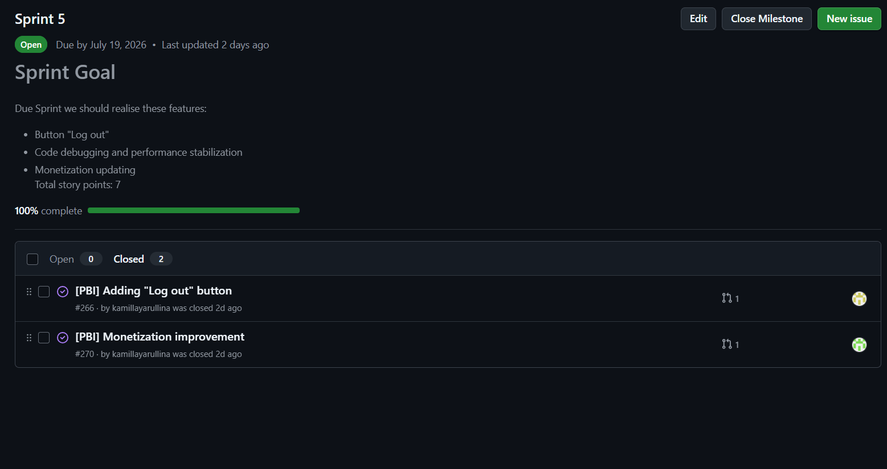
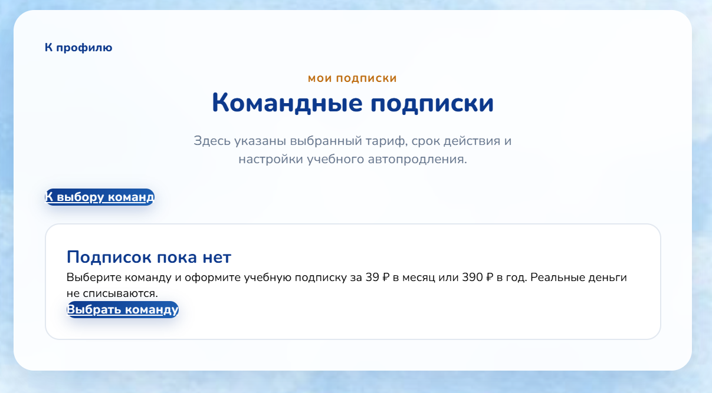
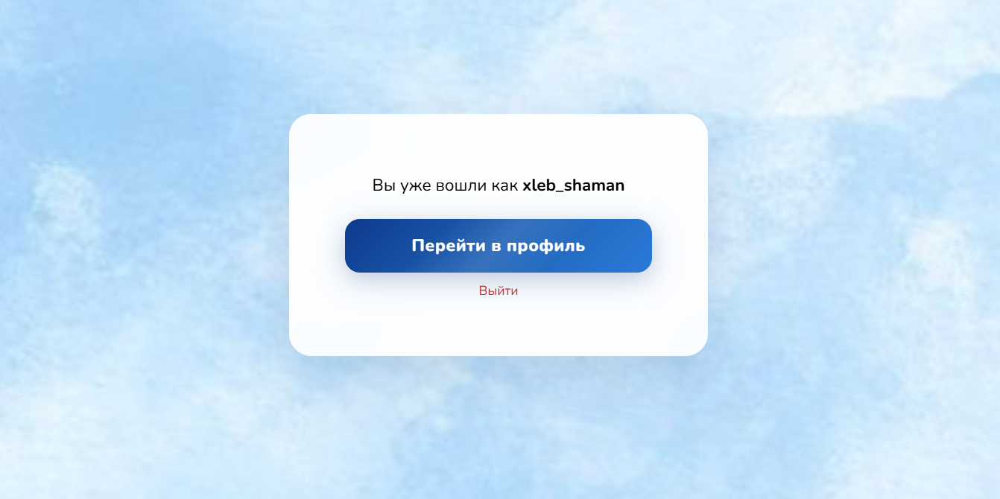
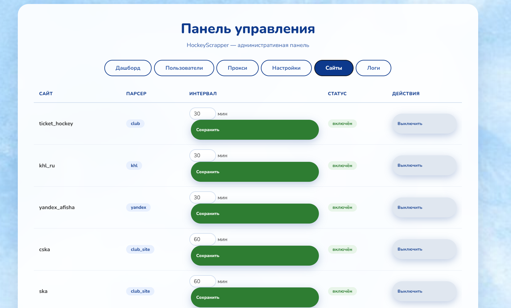
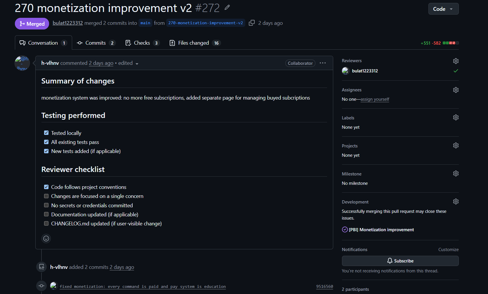
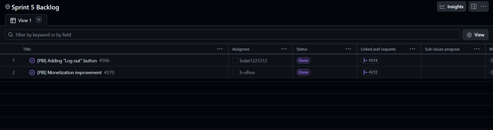

# Week 7 Report — Final Transition: HockeyScrapper

**Team number:** 25

**Project:** HockeyScrapper — a web platform that lets KHL fans follow teams, track ticket sales, and receive Telegram and email notifications.

**License:** [MIT](../../LICENSE)

**Previous report:** [Week 6 Report — Trial Release](../week6/README.md)

---

## Backlog and Sprint

### Product Backlog

- [**Product Backlog board**](https://github.com/users/kamillayarullina/projects/3/views/1)

### Sprint 5 — Assignment 7 Sprint (Final Transition / MVP v3)

- **Sprint milestone:** [Sprint 5 — Milestone 5](https://github.com/kamillayarullina/hockeyscrapper/milestone/5)
- [**Sprint 5 Backlog view**](https://github.com/users/kamillayarullina/projects/9/views/1)

### Sprint 5 Scope

**Sprint Goal:** Deliver logout button, monetisation improvement (first-team payment), and final maintenance changes for MVP v3.

**Sprint dates:** July 13, 2026 — July 19, 2026

| PBI | Issue | SP | Status |
|---|---|---|---|
| [PBI] Adding "Log out" button | [#266](https://github.com/kamillayarullina/hockeyscrapper/issues/266) | 2 | Done |
| [PBI] Monetization improvement | [#270](https://github.com/kamillayarullina/hockeyscrapper/issues/270) | 5 | Done |

**Total Sprint 5 size:** 7 SP

### Week 7 Follow-Up Maintenance and Final MVP v3 Changes

| Change | PR | Summary |
|---|---|---|
| Password toggle & Telegram binding fix | [#267](https://github.com/kamillayarullina/hockeyscrapper/pull/267) | Password visibility toggle on vhod/register pages, Telegram binding fix |
| Bot CommandObject, link_code migration, team limit, cache headers | [#268](https://github.com/kamillayarullina/hockeyscrapper/pull/268) | Bot fixes for CommandObject, link_code migration, team limit enforcement, cache headers |
| Logout button + auto-login redirect | [#274](https://github.com/kamillayarullina/hockeyscrapper/pull/274) | Added logout button to profile page, fixed auto-login redirect |
| Monetisation improvement v2 | [#272](https://github.com/kamillayarullina/hockeyscrapper/pull/272) | Extended monetisation: first team now requires payment, multiple subscription durations |
| KHL+Club+Yandex parsers overhaul | [#276](https://github.com/kamillayarullina/hockeyscrapper/pull/276), [#277](https://github.com/kamillayarullina/hockeyscrapper/pull/277) | Stealth mode, multi-city support, team mapping overhaul |

---

## Product Access

- **Deployed instance (Week 7):** [http://89.125.169.128:8000](http://89.125.169.128:8000)
- **Run instructions:** [README.md](../../README.md#local-setup) or [docs/development-process.md](../../docs/development-process.md)
- **Source:** [`README.md`](../../README.md)
- **Contributing:** [`CONTRIBUTING.md`](../../CONTRIBUTING.md)
- **Agent guidance:** [`AGENTS.md`](../../AGENTS.md)
- **Customer handover:** [`docs/customer-handover.md`](../../docs/customer-handover.md)
- **Hosted documentation site:** `https://kamillayarullina.github.io/hockeyscrapper/`

---

## Final Transition Outcome

**Handover level reached:** Ready for independent use with conditions.

**Customer-confirmation status:** Pending customer execution of transition steps. The handover document has been reviewed and acknowledged by the customer.

### What Was Transferred

The full scope of what was transferred, delegated, or made available is documented in [`docs/customer-handover.md`](../../docs/customer-handover.md). Key items:

| Asset | Status | Reference |
|---|---|---|
| Source code repository | Full access granted | `docs/customer-handover.md §1` |
| Documentation site | Published and archived | `docs/customer-handover.md §10` |
| Docker image + Render Blueprint | Defined in `render.yaml` | `docs/customer-handover.md §3` |
| Customer handover document | Finalised with step-by-step instructions | `docs/customer-handover.md` |
| Telegram bot | Functional, ownership transfer procedure documented | `docs/customer-handover.md §1` |
| Web dashboard | All MVP v3 features operational | `docs/customer-handover.md §2` |
| Installation / deployment guide | Documented with env var table | `docs/customer-handover.md §3-4` |
| Operational notes | Parser cycle, database, logging documented | `docs/customer-handover.md §5` |
| Troubleshooting guidance | Known issues and workarounds | `docs/customer-handover.md §6` |

### Remaining Transition Blockers

| Blocker | Severity | Reference |
|---|---|---|
| Hardcoded secrets in source code (JWT, SMTP, ADMIN_CHAT_ID) | Critical — must be moved to env vars | `docs/customer-handover.md §4` |
| Telegram bot registered under team account | High — transfer via BotFather required | `docs/customer-handover.md §1` |
| Customer has not yet created their own Render account | High — no independent deployment possible | `docs/customer-handover.md §9` |
| SMTP credentials still point to team-owned email | High — password recovery depends on team | `docs/customer-handover.md §4` |
| Backup/recovery procedures not yet documented | Medium — data loss risk | `docs/customer-handover.md §9` |

### Support Expectations

The team has provided all documentation for independent operation. No ongoing support commitment is in place beyond the procedures and troubleshooting guidance in `docs/customer-handover.md`.

### Customer-Independent Use

The customer can clone the repository, configure their own secrets, and deploy independently following `docs/customer-handover.md §3-4`. The current VPS instance at `139.100.225.113:8000` remains available for evaluation but is team-managed with no SLA.

---

## Customer Feedback Response Table for Sprint 5

| Feedback point | Resulting PBI or issue | Status | Response |
|---|---|---|---|
| Logout button should be added to profile page | [#266](https://github.com/kamillayarullina/hockeyscrapper/issues/266) | Done | Added logout button to profile page with auto-login redirect fix |
| Monetisation should require payment from first team subscription | [#270](https://github.com/kamillayarullina/hockeyscrapper/issues/270) | Done | Extended monetisation: first team now requires payment, multiple subscription durations |
| Parsers failing on some KHL club websites | [#276](https://github.com/kamillayarullina/hockeyscrapper/pull/276), [#277](https://github.com/kamillayarullina/hockeyscrapper/pull/277) | Done | Complete parser overhaul: stealth mode, multi-city support, team mapping |
| Password toggle visibility requested | [#267](https://github.com/kamillayarullina/hockeyscrapper/pull/267) | Done | Password visibility toggle added to login and register pages |
| Bot improvements for team limits and link codes | [#268](https://github.com/kamillayarullina/hockeyscrapper/pull/268) | Done | Team limit enforcement, link_code migration, cache headers |

### Feedback Not Addressed

- **Mobile compatibility** — Deferred. The customer acknowledged this as a future enhancement, not a release blocker.
- **Number of subscriptions (US-09)** — Not started. MoSCoW "Could have" — never prioritised.

---

## Week 7 UAT / Customer-Trial Results

All 7 UAT scenarios from the trial release remain active and passed. No new UAT scenarios were added for Sprint 5, as all work was follow-up maintenance and bug fixing.

| UAT | Description | Result | Last Executed |
|---|---|---|---|
| UAT-001 | Subscribe to a team | Pass | Daniil — 3 Jul 2026 |
| UAT-002 | Unsubscribe from a team | Pass | Daniil — 3 Jul 2026 |
| UAT-003 | Password recovery | Pass | Daniil — 3 Jul 2026 |
| UAT-004 | Manage parsing time (admin) | Pass | Daniil — 3 Jul 2026 |
| UAT-005 | Add proxy (admin) | Pass | Daniil — 3 Jul 2026 |
| UAT-006 | Upload avatar | Pass | Daniil — 3 Jul 2026 |
| UAT-007 | Purchase premium subscription | Pass | Daniil — 12 Jul 2026 |

Full details: [`docs/user-acceptance-tests.md`](../../docs/user-acceptance-tests.md)

---

## Release

| Artifact | Link |
|---|---|
| Final MVP v3 release (Sprint 5) | [v2.5.0](https://github.com/kamillayarullina/hockeyscrapper/releases/tag/v2.5.0) *(Sprint 5 changes tagged upon Sprint completion as MVP v3)* |
| CHANGELOG | [`CHANGELOG.md`](../../CHANGELOG.md) |

---

## Demo Video

Public sanitized demo video — walkthrough of all MVP v3 features including monetisation, parser overhaul, logout button, password toggle, and final product state.

[Google Drive — HockeyScrapper MVP v3 Demo](https://drive.google.com/drive/folders/1Jik9tWHFh7ghtRoKUfvXBMsKrjgGhDm7?usp=sharing)

---

## Demo Day Preparation

The required Week 7 rehearsal preparation was completed. The team prepared and rehearsed the final presentation covering:

- MVP v3 feature walkthrough
- Final transition and handover summary
- Architecture and testing highlights
- Lessons learned across all 7 weeks

---

## Sprint Review

- **Sprint Review summary:** [`reports/week7/sprint-review-summary.md`](sprint-review-summary.md)
- **Sprint Review transcript:** [`reports/week7/sprint-review-transcript.md`](sprint-review-transcript.md)

The Sprint Review recording and transcript were shared privately through the approved instructor channel. Publication of the full transcript was refused; notes are available through the private sharing channel.

---

## Week 7 Reports

| Report | Link |
|---|---|
| Sprint Review Summary | [`reports/week7/sprint-review-summary.md`](sprint-review-summary.md) |
| Reflection | [`reports/week7/reflection.md`](reflection.md) |
| Retrospective | [`reports/week7/retrospective.md`](retrospective.md) |
| LLM Report | [`reports/week7/llm-report.md`](llm-report.md) |

---

## Final Product Status

**Current state:** All three MVP milestones delivered.

- **MVP v1:** Subscription management, Telegram notifications, ticket price/date viewing
- **MVP v2:** Avatar upload, password recovery, admin panel, email notifications, quality requirement tests
- **MVP v3:** Monetisation (YooKassa / demo mode), parser improvements (stealth, multi-city, team mapping), error notifications, password strength, performance optimisation, logout button

The product is feature-complete and all 7 UAT scenarios pass. The repository is archived with finalised documentation, handover guide, and runbooks. The customer can deploy and operate the system independently after completing the transition steps documented in `docs/customer-handover.md`.

---

## Contribution Traceability

| Team Member | GitHub | Issues Created | PRs/MRs Authored | PRs/MRs Reviewed | Testing/QA | Architecture/Docs | Transition / Deployment | Demo Day Prep |
|---|---|---|---|---|---|---|---|---|
| Kamilla Iarullina | [kamillayarullina](https://github.com/kamillayarullina) | [issues](https://github.com/kamillayarullina/hockeyscrapper/issues?q=is%3Aissue+author%3Akamillayarullina) | [PRs](https://github.com/kamillayarullina/hockeyscrapper/issues?q=is%3Apr+author%3Akamillayarullina) | [reviews](https://github.com/kamillayarullina/hockeyscrapper/issues?q=is%3Apr+reviewed-by%3Akamillayarullina) | UAT execution, test review | Roadmap, sprint-review, handover review | Customer handover review, transition coordination | Presentation rehearsal, demo script |
| Gleb Shamiev | [xleb-sha](https://github.com/xleb-sha) | [issues](https://github.com/kamillayarullina/hockeyscrapper/issues?q=is%3Aissue+author%3Axleb-sha) | [PRs](https://github.com/kamillayarullina/hockeyscrapper/issues?q=is%3Apr+author%3Axleb-sha) | [reviews](https://github.com/kamillayarullina/hockeyscrapper/issues?q=is%3Apr+reviewed-by%3Axleb-sha) | Parser tests, CI verification | Deployment scripts, architecture diagrams, CHANGELOG | VPS maintenance, deployment stability | Infrastructure setup for demo |
| Samir Shakirov | [samirshakirov6](https://github.com/samirshakirov6) | [issues](https://github.com/kamillayarullina/hockeyscrapper/issues?q=is%3Aissue+author%3Asamirshakirov6) | [PRs](https://github.com/kamillayarullina/hockeyscrapper/issues?q=is%3Apr+author%3Asamirshakirov6) | [reviews](https://github.com/kamillayarullina/hockeyscrapper/issues?q=is%3Apr+reviewed-by%3Asamirshakirov6) | Monetisation testing, UAT support | customer-handover, reflection, retrospective, sprint-review | Handover document authoring | Presentation slides, demo preparation |
| Bulat Bulatov | [bulat1223312](https://github.com/bulat1223312) | [issues](https://github.com/kamillayarullina/hockeyscrapper/issues?q=is%3Aissue+author%3Abulat1223312) | [PRs](https://github.com/kamillayarullina/hockeyscrapper/issues?q=is%3Apr+author%3Abulat1223312) | [reviews](https://github.com/kamillayarullina/hockeyscrapper/issues?q=is%3Apr+reviewed-by%3Abulat1223312) | Parser testing, bug verification | — | Parser deployment, bot fix rollout | Feature demonstration |
| Khamza Valikhanov | [h-vlhnv](https://github.com/h-vlhnv) | [issues](https://github.com/kamillayarullina/hockeyscrapper/issues?q=is%3Aissue+author%3Ah-vlhnv) | [PRs](https://github.com/kamillayarullina/hockeyscrapper/issues?q=is%3Apr+author%3Ah-vlhnv) | [reviews](https://github.com/kamillayarullina/hockeyscrapper/issues?q=is%3Apr+reviewed-by%3Ah-vlhnv) | Monetisation testing | Monetisation research, documentation | — | Monetisation demo |

---

## Screenshots

### Sprint Milestone

### Final MVP v3 Release

### Final Product Access — Deployed Instance

  
  

### Example Reviewed Issue-Linked PR

### Sprint 5 Backlog Board

